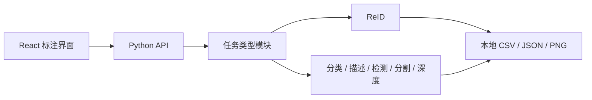

# Annotation Toolkits

面向本地数据集的多任务标注平台。项目以 Label Studio 的项目、任务队列、标签配置和
标注交互作为产品参考，但使用自己的轻量实现，不复制或嵌入 Label Studio 源码，也不
引入用户注册、权限控制、云存储或容器部署体系。

当前可用任务类型：ReID 数据提取/候选挖掘/人工审核/逻辑冲突检测/数据定版及训练交接、
图像分类、图像描述、目标检测、图像分割、深度图画笔标注。文本标注的范围仍在
[#20](https://github.com/seagochen/annotation-toolkits/issues/20) 中讨论，尚未实现。

## 架构



React 项目导航、ReID 成对审核、图像分类、图像描述、目标检测、图像分割、深度图画笔和
统一 API 均已可用；ReID 流水线动作也由项目详情页统一触发并显示持久化日志和结果。前端
的共享图像画布（原图坐标变换、独立 overlay layers、缩放/平移）与栅格/多边形/检测框
图元被检测、分割和深度三个任务复用，没有各自维护一套画布或像素编辑逻辑。

## 功能状态

| 能力 | 状态 |
| --- | --- |
| ReID 提取、挖掘、审核与冲突检测 | 可用 |
| 原子写入、审计与训练清单 | 可用 |
| 后端/前端目录边界 | 可用 |
| 多项目 Python 注册表 | 可用 |
| 多项目统一 HTTP API | 可用（项目、队列、标注、动作） |
| React 项目列表和详情 | 可用 |
| React ReID 标注界面 | 可用 |
| 图像单标签/多标签分类 | 可用 |
| 图像描述（captioning） | 可用 |
| 目标检测（COCO 兼容导出） | 可用 |
| 图像分割（画笔 + 多边形，COCO 兼容导出） | 可用 |
| 深度图画笔标注 | 可用 |
| 共享图像画布、overlay 与坐标变换 | 可用 |
| 文本标注 | 范围未定（[#20](https://github.com/seagochen/annotation-toolkits/issues/20)） |

## 导出格式

每种任务类型的标注数据模型、提交/导出 JSON 形状和示例命令见
[`docs/`](docs/) 下的对应文档：[`reid`](docs/reid.md)、
[`classification`](docs/classification.md)、[`caption`](docs/caption.md)、
[`detection`](docs/detection.md)、[`segmentation`](docs/segmentation.md)、
[`depth`](docs/depth.md)。检测与分割的 `coco` 导出格式是 COCO 兼容而非完整
实现（分割的 `segmentation` 字段引用掩膜 PNG 文件，不是 RLE/polygon 编码），
详见各自文档。

从旧 ReID CLI 迁移的用户请看 [`docs/reid.md`](docs/reid.md) 的路径迁移速查表。

## 运行要求

- Python 3.10 或更高版本；
- 仅审核、检查和定版时只需要基础 Python 依赖；
- 视频抽取、候选挖掘及参考检测流水线需要对应的可选依赖；
- 数据、配置和标注结果全部保存在本地文件系统。

## 快速开始

```bash
python3 -m venv .venv
source .venv/bin/activate
pip install -e 'backend[test]'

python backend/app.py init
$EDITOR reid.yaml
python backend/app.py status
```

启动统一项目 API（注册表格式见 `backend/configs/projects.example.yaml`）：

```bash
export ANNOTATION_PROJECTS_CONFIG=backend/configs/projects.example.yaml
uvicorn annotation_platform.server:app --app-dir backend --reload
```

服务默认监听 `127.0.0.1:8000`，接口文档位于 `http://127.0.0.1:8000/docs`。开发环境
CORS 默认只允许 `http://localhost:5173` 和 `http://127.0.0.1:5173`；需要其他明确来源时，
通过逗号分隔的 `ANNOTATION_CORS_ORIGINS` 配置，不接受 `*`。

另开终端启动 React 项目导航：

```bash
cd frontend
npm install
npm run dev
```

浏览器访问 `http://127.0.0.1:5173`；开发服务器会把 `/api` 请求代理到上述 FastAPI
服务。审核和六个 ReID 流水线动作均从对应项目页面进入。前端的完整开发、类型生成与
验证命令见 [`frontend/README.md`](frontend/README.md)。

需要执行视频抽取和候选挖掘时，安装完整可选依赖：

```bash
pip install -e 'backend[extract,ultralytics]'
```

ReID 的数据约束、配置、流水线接入和完整操作说明见
[`backend/README.md`](backend/README.md)。

## 仓库结构

```text
backend/   FastAPI 平台、各任务类型模块、测试、配置和参考流水线
frontend/  React/TypeScript 项目导航与任务工作台
docs/      各任务类型的标注数据模型与导出格式文档
```

项目路线与未完成工作以 GitHub Issues 为准。
