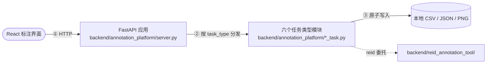

# Annotation Toolkits（本地多任务标注平台）

面向本地数据集的多任务标注平台：一个 React 前端通过统一 HTTP API 驱动多个本地
"项目"，标注结果原子写入本地文件系统，不依赖数据库、用户账户或云存储。项目以
Label Studio 的项目、任务队列、标签配置和标注交互作为产品参考，但使用自己的轻量
实现，不复制或嵌入 Label Studio 源码。

> 本仓库的设计文档以 [`docs/detailed_design/`](docs/detailed_design/00_概述.md) 为
> 唯一正源（SSoT）。本 README 仅作工程总览与快速上手，详细设计一律链接到 `docs/`。

## 概述

浏览器里的一次标注提交，完整链路是：React 任务页面把画布/表单产出的结果发给
统一 HTTP API → API 通过项目注册表解析出这个项目该用哪个任务类型模块 → 任务类型
模块校验并原子写入本地文件。**任务类型通过统一协议接入，平台层不理解任何任务
专属字段**——新增一种标注任务不需要修改 HTTP 路由或前端路由的分发逻辑之外的代码。



详细架构、数据流与模块职责见 [`docs/detailed_design/00_概述.md`](docs/detailed_design/00_概述.md)。

### 主要功能

| 任务类型 | 功能 | 实现 |
|---|---|---|
| `reid` | 数据抽取、候选挖掘、成对审核、逻辑冲突检测、数据定版、训练交接 | [`backend/reid_annotation_tool/`](backend/reid_annotation_tool/) |
| `classification` | 图像单/多标签分类 | [`classification_task.py`](backend/annotation_platform/classification_task.py) |
| `captioning` | 图像自由文本描述 | [`caption_task.py`](backend/annotation_platform/caption_task.py) |
| `detection` | 目标检测框标注，COCO 兼容导出 | [`detection_task.py`](backend/annotation_platform/detection_task.py) |
| `segmentation` | 图像分割（画笔 + 多边形），COCO 兼容导出 | [`segmentation_task.py`](backend/annotation_platform/segmentation_task.py) |
| `depth` | 深度图画笔标注 | [`depth_task.py`](backend/annotation_platform/depth_task.py) |

> 以上六种任务类型均已端到端验证（单元测试 + 一次真实浏览器交互，见
> [`docs/detailed_design/00_概述.md`](docs/detailed_design/00_概述.md) §16.1）。
> 文本标注的范围仍在 [#20](https://github.com/seagochen/annotation-toolkits/issues/20)
> 中讨论，尚未实现。

## 运行要件

| 项 | 值 |
|---|---|
| 后端语言 / 运行环境 | Python（见 [`backend/pyproject.toml`](backend/pyproject.toml)） |
| 前端语言 / 运行环境 | Node.js + npm（见 [`frontend/package.json`](frontend/package.json)） |
| 硬件 | 无特殊要求；ReID 的视频抽取/候选挖掘有 GPU 更快，非必需 |
| 存储 | 全部数据、配置和标注结果保存在本地文件系统 |

后端核心依赖只有 FastAPI/PyYAML/uvicorn；`backend/annotation_platform/` 运行时不
依赖 Pillow/numpy（分割/深度的 PNG 编码用标准库手写实现）。详情见
[`docs/detailed_design/10_通用设计.md`](docs/detailed_design/10_通用设计.md) §5、§7。

## 快速开始

```bash
python3 -m venv .venv
source .venv/bin/activate
pip install -e 'backend[test]'

export ANNOTATION_PROJECTS_CONFIG=backend/configs/projects.example.yaml
uvicorn annotation_platform.server:app --app-dir backend --reload
```

另开终端启动前端：

```bash
cd frontend
npm install
npm run dev
```

浏览器访问 `http://127.0.0.1:5173`。服务默认监听 `127.0.0.1:8000`，接口文档见
`http://127.0.0.1:8000/docs`；开发环境 CORS 默认只允许 `localhost:5173`/
`127.0.0.1:5173`，其余来源与完整环境变量参考见
[`docs/detailed_design/80_配置参考.md`](docs/detailed_design/80_配置参考.md)。

需要执行 ReID 的视频抽取和候选挖掘时：

```bash
pip install -e 'backend[extract,ultralytics]'
```

ReID 的数据约束、流水线接入和完整操作说明见 [`backend/README.md`](backend/README.md)；
前端的完整开发、类型生成与验证命令见 [`frontend/README.md`](frontend/README.md)。

## 文档

| 文档 | 内容 |
|---|---|
| [`docs/`](docs/README.md) | 文档总目录 |
| [`docs/detailed_design/`](docs/detailed_design/00_概述.md) | 详细设计书（SSoT） |
| [`docs/detailed_design/70_外部接口.md`](docs/detailed_design/70_外部接口.md) | HTTP API 与各任务类型的提交/导出格式 |
| [`docs/detailed_design/80_配置参考.md`](docs/detailed_design/80_配置参考.md) | 配置项与环境变量参考 |
| [`docs/detailed_design/90_部署与运维.md`](docs/detailed_design/90_部署与运维.md) | 安装、启动、打包、运维 |
| [`backend/README.md`](backend/README.md) | ReID 深度操作手册（流水线接入、训练交接、低精度约束） |

## 项目结构

```text
backend/
├── annotation_platform/   # 任务类型协议 + 六个内置模块 + FastAPI 应用
├── reid_annotation_tool/  # ReID CLI 与流水线
├── pipeline/              # 参考推理流水线
├── configs/               # 各任务类型 / 项目注册表的示例配置
└── tests/                 # pytest 测试

frontend/
└── src/
    ├── api/                       # 生成的 OpenAPI 类型 + 手写 client
    ├── components/image-canvas/   # 共享画布图元（检测/分割/深度复用）
    ├── pages/                     # 项目列表/详情、画布 demo
    └── tasks/<type>/              # 各任务类型的标注页面

docs/detailed_design/      # 详细设计书（SSoT）
```

## 相关说明

本平台是本地单用户、局域网场景，没有身份认证、没有多用户权限——这是产品定位的
一部分，见 [`docs/detailed_design/10_通用设计.md`](docs/detailed_design/10_通用设计.md) §3。
项目路线与未完成工作以 GitHub Issues 为准；设计细节以
[`docs/detailed_design/`](docs/detailed_design/00_概述.md) 为准，具体数值以对应
源码/配置文件为一次信息源。
