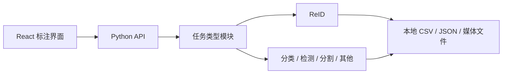

# Annotation Toolkits

面向本地数据集的多任务标注平台。项目以 Label Studio 的项目、任务队列、标签配置和
标注交互作为产品参考，但使用自己的轻量实现，不复制或嵌入 Label Studio 源码，也不
引入用户注册、权限控制、云存储或容器部署体系。

当前可用能力是 ReID 数据提取、候选挖掘、人工审核、逻辑冲突检测、数据定版及训练交接；
平台化迁移正在进行中，后续将在统一后端和前端框架中加入分类、检测、分割、文本、图像
描述和深度标注。

## 架构



React 前端和统一 API 尚在建设中；现阶段 ReID 继续通过原有本地 Web 工作台运行。

## 功能状态

| 能力 | 状态 |
| --- | --- |
| ReID 提取、挖掘、审核与冲突检测 | 可用 |
| 原子写入、审计与训练清单 | 可用 |
| 后端/前端目录边界 | 建设中 |
| 多项目 Python 注册表 | 可用 |
| 多项目统一 HTTP API | 规划中 |
| React 标注界面 | 规划中 |
| 分类、检测、分割、文本、描述和深度任务 | 规划中 |

## 运行要求

- Python 3.10 或更高版本；
- 仅审核、检查和定版时只需要基础 Python 依赖；
- 视频抽取、候选挖掘及参考检测流水线需要对应的可选依赖；
- 数据、配置和标注结果全部保存在本地文件系统。

## 快速开始

```bash
python3 -m venv .venv
source .venv/bin/activate
pip install -e 'backend[test]'

python backend/app.py init
$EDITOR reid.yaml
python backend/app.py status
python backend/app.py
```

需要执行视频抽取和候选挖掘时，安装完整可选依赖：

```bash
pip install -e 'backend[extract,ultralytics]'
```

ReID 的数据约束、配置、流水线接入和完整操作说明见
[`backend/README.md`](backend/README.md)。

## 仓库结构

```text
backend/   Python 后端、现有 ReID 工作台、测试、配置和参考流水线
frontend/  React/TypeScript 前端（待建立）
```

项目路线与未完成工作以 GitHub Issues 为准。
