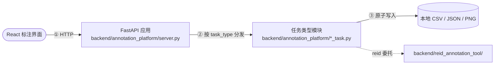

# Annotation Toolkits（多任务标注工作台）

面向本地数据集的多任务标注平台：一个 React 前端通过统一 HTTP API 驱动多个本地
"项目"，标注结果原子写入本地文件系统，不依赖数据库、用户账户或云存储。项目以
Label Studio 的项目、任务队列、标签配置和标注交互作为产品参考，但使用自己的轻量
实现，不复制或嵌入 Label Studio 源码。以上是本地 standalone 形态；独立 hosted 形态通过
受限 REST 复用 Skills Master 账号和通用 AI，按用户隔离持久数据，自己的服务负责全部业务。
两种启动入口明确区分，不以无认证的本地端口作为公网 hosted 服务。

> 需求与设计入口见 [`docs/`](docs/README.md)：需求、总体架构与模块契约分别由对应书群维护。
> 本 README 仅作工程总览与快速上手。

## 概述

浏览器里的一次标注提交，完整链路是：React 任务页面把画布/表单产出的结果发给
统一 HTTP API → API 通过项目注册表解析出这个项目该用哪个任务类型模块 → 任务类型
模块校验并原子写入本地文件。**任务类型通过统一协议接入，平台层不理解任何任务
专属字段**——新增一种标注任务不需要修改 HTTP 路由或前端路由的分发逻辑之外的代码。


```mermaid
flowchart LR
    Browser(["React 标注界面"]) -- "① HTTP" --> API["FastAPI 应用<br/>backend/annotation_platform/server.py"]
    API -- "② 按 task_type 分发" --> Modules["任务类型模块<br/>backend/annotation_platform/*_task.py"]
    Modules -- "③ 原子写入" --> Files[("本地 CSV / JSON / PNG")]
    Modules -. "reid 委托" .-> ReID["backend/reid_annotation_tool/"]
```

总体架构与数据流见[总体设计](docs/overall_design/00_概述.md)，模块契约见[详细设计](docs/detailed_design/00_概述.md)。

### 主要功能

| 任务类型 | 功能 | 实现 |
|---|---|---|
| `reid` | 数据抽取、候选挖掘、成对审核、逻辑冲突检测、数据定版、训练交接 | [`backend/reid_annotation_tool/`](backend/reid_annotation_tool/) |
| `classification` | 图像或文本文档的单/多标签分类 | [`classification_task.py`](backend/annotation_platform/img_annotation/standard/classification_task.py) |
| `captioning` | 图像描述；文本文档的翻译、摘要等自由文本生成 | [`caption_task.py`](backend/annotation_platform/img_annotation/standard/caption_task.py) |
| `text_span` | 文本片段（实体/区间）标注，允许重叠与嵌套 | [`text_span_task.py`](backend/annotation_platform/img_annotation/standard/text_span_task.py) |
| `detection` | 目标检测框标注，COCO 兼容导出 | [`detection_task.py`](backend/annotation_platform/img_annotation/standard/detection_task.py) |
| `segmentation` | 图像分割（画笔 + 多边形），COCO 兼容导出 | [`segmentation_task.py`](backend/annotation_platform/img_annotation/standard/segmentation_task.py) |
| `polygon` | 可编辑的多边形、矩形框、关键点（可混合），矢量橡皮，COCO 预标导入、按版本修订已提交结果、标准 COCO 导出（关键点为 COCO keypoints） | [`polygon_task.py`](backend/annotation_platform/img_annotation/standard/polygon_task.py) |
| `depth` | 深度图画笔标注 | [`depth_task.py`](backend/annotation_platform/img_annotation/depth/depth_task.py) |

> 以上任务类型均已端到端验证（单元测试 + 一次真实浏览器交互，见
> [`docs/detailed_design/00_概述.md`](docs/detailed_design/00_概述.md) §16.1）。
> 文本标注范围已在 [#20](https://github.com/seagochen/annotation-toolkits/issues/20)
> 中决定：文档级分类/自由文本生成复用 `classification`/`captioning`（数据源由
> `patterns` 决定，可以是 UTF-8 文本，[#39](https://github.com/seagochen/annotation-toolkits/issues/39)），
> span/区间标注新增独立模块 `text_span`（[#40](https://github.com/seagochen/annotation-toolkits/issues/40)）。

## 运行要件

| 项 | 值 |
|---|---|
| 后端语言 / 运行环境 | Python（见 [`backend/pyproject.toml`](backend/pyproject.toml)） |
| 前端语言 / 运行环境 | Node.js + npm（见 [`frontend/package.json`](frontend/package.json)） |
| 硬件 | 无特殊要求；ReID 的视频抽取/候选挖掘有 GPU 更快，非必需 |
| 存储 | 全部数据、配置和标注结果保存在本地文件系统 |

standalone 后端核心依赖只有 FastAPI/PyYAML/uvicorn；`backend/annotation_platform/` 运行时不
依赖 Pillow/numpy（分割/深度的 PNG 编码用标准库手写实现）。详情见
[`docs/detailed_design/10_通用设计.md`](docs/detailed_design/10_通用设计.md) §5、§7。

## 快速开始

```bash
python3 -m venv .venv
source .venv/bin/activate
pip install -e 'backend[test]'

# 工作区：项目配置、上传的数据和标注结果都保存在这里，首次使用时自动创建
export ANNOTATION_WORKSPACE=./workspace
uvicorn annotation_platform.server:app --app-dir backend --reload
```

另开终端启动前端：

```bash
cd frontend
npm install
npm run dev
```

浏览器访问 `http://127.0.0.1:5173`，点左侧"新建项目"选择标注任务、填写属性，
然后在项目里导入数据、标注和导出；项目只能在界面中创建和管理。关联服务器上已有的
图片目录需要先用 `ANNOTATION_IMPORT_ROOTS` 允许该位置。服务默认监听 `127.0.0.1:8000`，接口文档见
`http://127.0.0.1:8000/docs`；开发环境 CORS 默认只允许 `localhost:5173`/
`127.0.0.1:5173`，其余来源与完整环境变量参考见
[`docs/detailed_design/80_配置参考.md`](docs/detailed_design/80_配置参考.md)。

需要执行 ReID 的视频抽取和候选挖掘时：

```bash
pip install -e 'backend[extract,ultralytics]'
```

ReID 的数据约束、流水线接入和完整操作说明见 [`backend/README.md`](backend/README.md)；
前端的完整开发、类型生成与验证命令见 [`frontend/README.md`](frontend/README.md)。

### Docker 部署（GPU）

镜像同时包含前端构建产物与后端，单端口 `3000` 提供页面和 API；运行时带 CUDA 12.6 +
cuDNN 9，供 ReID 抽取/候选挖掘使用 GPU（需要宿主机安装 NVIDIA Container Toolkit）。

```bash
# <dir> 作为工作区挂载到 /data；要在界面中关联的服务器目录用 --mount 挂载
python3 docker/build_and_run.py --data <dir> [--mount /abs/dataset/path ...]
```

浏览器访问 `http://<host>:3000`。平台没有登录，默认在所有网卡上开放；只在本机使用时
加 `--bind 127.0.0.1`。挂载、权限与 GPU 检查见
[`90_部署与运维.md`](docs/detailed_design/90_部署与运维.md) §3。

## 导出

每个项目的"导出"页按任务类型提供格式（原生 JSON、CSV、COCO 等）。每种格式都有带
版本号的导出契约（如 `polygon-coco/v2`），下载前会按契约校验。不经浏览器时用命令行
做确定性导出与校验：

```bash
# 已 pip install -e backend；工作区取 ANNOTATION_WORKSPACE（或 --workspace）
python -m annotation_platform.exports contracts                      # 列出全部契约
python -m annotation_platform.exports export <project-id> --format coco --output out.json
python -m annotation_platform.exports check polygon-coco/v2 out.json  # 校验任意来源的文件
```

各契约的字段、坐标/编码规则与示例见
[`70_外部接口.md`](docs/detailed_design/70_外部接口.md)"导出契约"。

### 从旧 ReID CLI 迁移

原仓库根目录下的 ReID 工具已移到 `backend/`：CLI 子命令和数据集文件格式不变，
旧的 `serve` 网页由本平台取代。路径、命令与兼容性变化的对照表见
[`30_ReID流水线.md`](docs/detailed_design/30_ReID流水线.md) §5。

## 文档

| 文档 | 内容 |
|---|---|
| [`docs/`](docs/README.md) | 文档总目录 |
| [`docs/requirements/`](docs/requirements/00_概述.md) | 需求分析书：目标、范围、需求与验收 |
| [`docs/overall_design/`](docs/overall_design/00_概述.md) | 总体设计书：架构、职责、数据与部署边界 |
| [`docs/detailed_design/`](docs/detailed_design/00_概述.md) | 详细设计书：模块契约与实现 |
| [`docs/detailed_design/70_外部接口.md`](docs/detailed_design/70_外部接口.md) | HTTP API、各任务类型的提交格式与版本化导出契约（含示例与校验命令） |
| [`docs/detailed_design/80_配置参考.md`](docs/detailed_design/80_配置参考.md) | 配置项与环境变量参考 |
| [`docs/detailed_design/90_部署与运维.md`](docs/detailed_design/90_部署与运维.md) | 安装、启动、打包、运维 |
| [`backend/README.md`](backend/README.md) | ReID 深度操作手册（流水线接入、训练交接、低精度约束） |

## 项目结构

```text
backend/
├── annotation_platform/   # 任务类型协议 + FastAPI 应用 + 工作区管理
│   └── img_annotation/    # 内置任务模块，按工具类别分层（与前端一致）
│       ├── common/        # 图像任务共用的数据集/侧车存储、PNG 编码
│       ├── standard/      # 分类、描述、文本片段、检测、分割、多边形
│       ├── reid/          # ReID 平台适配层
│       └── depth/         # 深度图
├── reid_annotation_tool/  # ReID CLI 与流水线（引擎）
├── local_files/           # 两个包共用的原子写入原语与路径锁
├── pipeline/              # 参考推理流水线
├── configs/               # 各任务类型 / 项目注册表的示例配置
└── tests/                 # pytest 测试

frontend/
└── src/
    ├── api/                       # 生成的 OpenAPI 类型 + 手写 client
    ├── components/                # 应用外壳：侧边导航、属性表单、加载/错误态
    ├── pages/                     # 项目列表/详情、画布 demo
    └── img-annotation/            # 标注工具，按类别分层；pages.ts 为任务类型 → 页面路由表
        ├── common/                # 共用：画布图元、工作台布局/工具栏/撤销、队列循环、图像列表
        ├── standard/              # 通用传统标注：分类、描述、文本片段、检测、分割、多边形
        ├── reid/                  # ReID / 相似度成对审核
        └── depth/                 # 深度图标注

Dockerfile                # 前端构建 + CUDA 运行时的多阶段镜像
docker/                   # 容器入口脚本与 build_and_run.py

docs/requirements/        # 需求与验收标准
docs/overall_design/      # 总体架构与跨系统约束
docs/detailed_design/     # 模块契约与实现设计
```

## 相关说明

standalone 是本地单用户、局域网场景；hosted 的 REST 身份与逐用户隔离独立于本地模式，见 [`docs/detailed_design/10_通用设计.md`](docs/detailed_design/10_通用设计.md) §3。
项目路线与未完成工作以 GitHub Issues 为准；需求与设计按 [docs 文档导航](docs/README.md)
在各自书群维护，具体数值以对应源码/配置文件为一次信息源。

## Skills Master 独立 hosted 服务

使用 [`Dockerfile.hosted`](Dockerfile.hosted) 与 [`module.hosted.json`](module.hosted.json)
构建 CPU 应用服务；原 `Dockerfile` 保留本地 CUDA/ReID 形态。hosted 默认端口 8080，
`/healthz` 不依赖登录，页面与 API 同源。公开地址采用复数
`https://annotation.apps.skillsmaster.jp`，平台只提供账号交接和通用推理。

```bash
pip install -e 'backend[hosted]'
export WEB_APP_DATA_DIR=/protected/annotation-data
export WEB_APP_PUBLIC_ORIGIN=https://annotation.apps.skillsmaster.jp
export SKILLSMASTER_API_BASE_URL=https://www.skillsmaster.jp
export ANNOTATION_FRONTEND_DIST=./frontend/dist
uvicorn annotation_platform.hosted:create_hosted_app --factory --app-dir backend --host 127.0.0.1 --port 8080
```

平台登记精确 callback 并授权 `platform.auth` / `platform.ai-runs` 后，浏览器通过自己的
`/auth/platform/login` 发起 PKCE 交接，每次业务请求通过 REST 校验身份。应用没有平台
账号库或长期 key；注销、停用、过期和平台不可用都会阻断业务请求。项目、素材、标注和
AI 作业保存在 `users/<账号身份摘要>/`，不能通过传入账号 ID 选择其他工作区。

hosted 支持 classification、captioning、text_span、detection、segmentation 与 polygon；
ReID/depth 的本地执行与服务器路径能力不在此托管范围。托管项目只接收文件上传，不能
关联宿主目录。polygon 项目的“AI 建议”通过 REST 提交检测，应用保存作业、原图摘要和
原标注版本，人工接受后才写入标注；冲突不会覆盖新结果。

旧平台数据转换与完整应用备份的命令、拒绝条件和回退流程见
[部署与运维](docs/detailed_design/90_部署与运维.md#6-hosted-迁移备份与恢复)。

托管 AI 作业保存原多边形、框和关键点的完整快照，接受建议时保留原图形；
旧作业仍可恢复。请求 AI 和接受建议均拒绝尚未提交的草稿，须先提交或放弃草稿，
避免自动保存与 AI 写入相互覆盖；此检查与原生提交共用应用内部锁。
