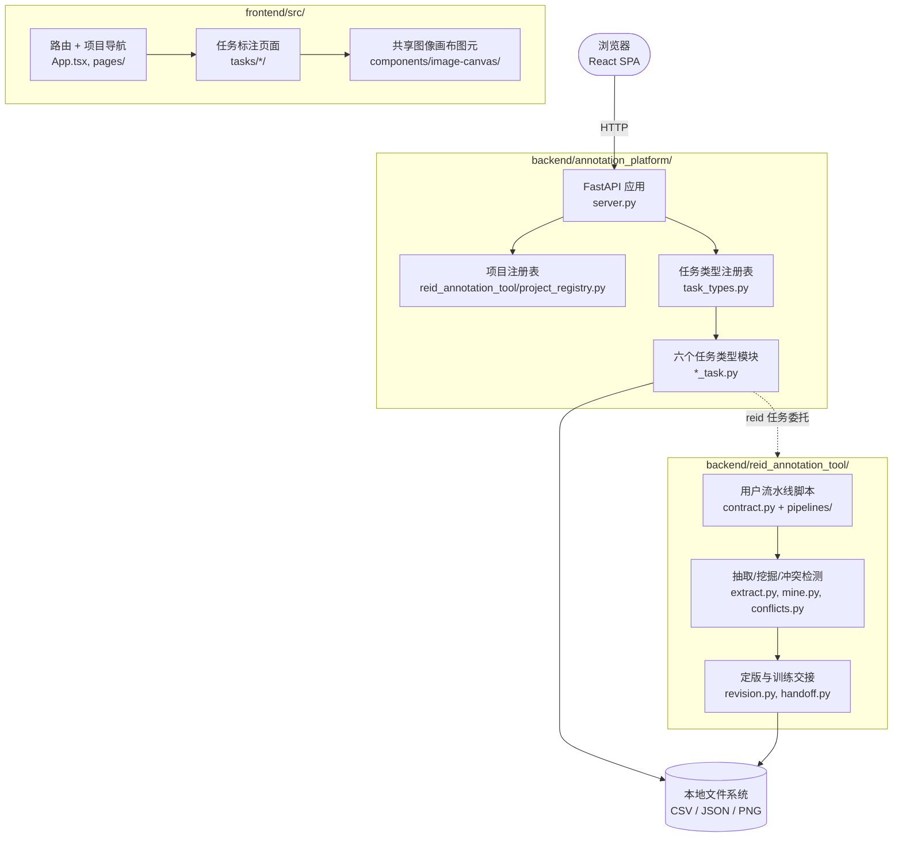

# 详细设计书 Annotation Toolkits 概述

本书群以**模块单位**拆分文档，以本文件（概述・亲文档）为起点，由多个子文档共同构成一份详细设计书。

## 0. 关于本书群

### 0.1 文档构成

| 文件 | 范围 |
|---|---|
| `00_概述.md`（本书） | 参照/追溯・系统全貌・系统要件・移交 |
| [`05_术语表.md`](05_术语表.md) | 项目专有术语与概念定义 |
| [`10_通用设计.md`](10_通用设计.md) | 数据模型・错误处理・安全・性能・实现约束・测试方针・依赖库 |
| [`20_标注平台后端.md`](20_标注平台后端.md) | `backend/annotation_platform/`：任务类型插件协议、内置任务模块、HTTP API |
| [`30_ReID流水线.md`](30_ReID流水线.md) | `backend/reid_annotation_tool/`：ReID 数据抽取、挖掘、冲突检测、定版与训练交接 |
| [`40_React前端.md`](40_React前端.md) | `frontend/src/`：项目导航、共享图像画布、各任务标注页面 |
| [`70_外部接口.md`](70_外部接口.md) | HTTP API 完整规格：端点、字段表、请求示例 |
| [`80_配置参考.md`](80_配置参考.md) | `projects.yaml`、各任务类型配置、环境变量参考 |
| [`90_部署与运维.md`](90_部署与运维.md) | 安装、启动、CORS、备份与日常运维 |

参照/追溯和向下一工程的移交集中在本亲文档。

### 0.2 编辑方针（与代码的同步）

- **对代码以参照为主**：类・函数・类型・配置以文件路径与符号名引用，不转记代码本体、数值与默认值；接口以契约（职责・前后条件）级别描述。
- **对其他文档自包含**：与 README 等重复的设计信息收敛进本书群，本书群为唯一正源（SSoT）。

---

## 1. 参照文档・追溯性

### 1.1 参照文档

| 区分 | 文档 | 所在 | 备注 |
|---|---|---|---|
| 工程总览 | `README.md` | 仓库根 | 快速上手入口，设计信息以本书群为准 |
| ReID 深度操作手册 | `backend/README.md` | `backend/` | 数据流、流水线接入、`reid.yaml` 各节归属、低精度部署约束——本书群 [`30_ReID流水线.md`](30_ReID流水线.md) 引用而不重复 |
| 前端开发指引 | `frontend/README.md` | `frontend/` | 开发服务器启动、API 类型生成、验证命令 |
| 配置一次信息源 | `backend/configs/*.example.yaml` | `backend/configs/` | 各任务类型配置项与默认值 |
| 共享画布组件契约 | `frontend/src/components/image-canvas/README.md` | `frontend/src/components/image-canvas/` | 坐标系、图层、指针事件、快捷键 |

### 1.2 追溯性（需求 ↔ 设计）

上位基本设计书未制定，本仓库以 GitHub Issues 作为需求依据，暂留追溯框架：

| 需求 ID | 需求名 | 对应子文档・位置 | 状态 |
|---|---|---|---|
| #8 | 建成多任务标注平台（Epic） | 全书群 | 进行中：M1–M3 已完成，M4（#23）部分完成 |
| #16 | 共享图像画布原语 | [`40_React前端.md`](40_React前端.md) §5 | 已完成 |
| #18/#21/#22 | 检测/分割/深度任务类型 | [`20_标注平台后端.md`](20_标注平台后端.md)、[`70_外部接口.md`](70_外部接口.md) | 已完成 |
| #20 | 文本标注范围决策 | （待定） | 未决定，不在本书群任何子系统文档中 |
| #23 | 各任务导出格式与文档 | [`70_外部接口.md`](70_外部接口.md) | 六种已实现任务类型已文档化；文本任务待 #20 |

---

## 2. 系统概述

### 2.1 概述

Annotation Toolkits 是一个面向本地数据集的多任务标注平台：一个 React 前端通过统一
HTTP API 驱动多个本地"项目"，每个项目绑定一种任务类型（ReID 成对审核、图像分类、
图像描述、目标检测、图像分割、深度图画笔），标注结果原子写入本地文件系统
（JSON/CSV 侧车文件 + PNG 栅格），不依赖数据库、用户账户或云存储。

核心架构原则：

- **任务类型通过统一协议接入，平台层不理解任务专属字段。** 每种任务把自己的标签、
  框、掩膜语义封装在自己的模块里，只对外暴露 `load/queue/submit/status/export`
  五个方法（见 [`20_标注平台后端.md`](20_标注平台后端.md) §3）；HTTP 层、项目注册表
  和前端路由都只依赖这五个方法，不 `if task_type == "..."` 分支处理业务字段。
- **本地、单用户、局域网信任模型。** 没有认证、没有多用户权限；`server.py` 的唯一
  安全边界是显式的 CORS 来源白名单和文件路径遍历防护（见
  [`10_通用设计.md`](10_通用设计.md) §3）。
- **服务端只做它必须做的图像处理，能不碰像素就不碰。** 分割/深度任务的栅格提交、
  存储、幂等判定全部基于像素哈希和一个自研的极简 PNG 编码器（纯标准库，无
  Pillow/numpy），服务端从不解码任意 PNG；反过来，检测/分割/深度所需的图像尺寸由
  浏览器测量后随请求一起提交（见 [`20_标注平台后端.md`](20_标注平台后端.md) §5、
  [`10_通用设计.md`](10_通用设计.md) §4）。

### 2.2 主要功能

- **ReID 成对审核**：接入用户自己的检测/跟踪流水线脚本，人工审核候选对，逻辑冲突
  检测，数据定版与训练交接。入口：`backend/reid_annotation_tool/`，见
  [`30_ReID流水线.md`](30_ReID流水线.md)。
- **图像分类**：单/多标签选择，JSON 侧车存储。`ClassificationTaskType`
  （[`backend/annotation_platform/classification_task.py`](../../backend/annotation_platform/classification_task.py)）。
- **图像描述**：自由文本描述，复用分类的队列/提交基础设施。`CaptionTaskType`
  （[`backend/annotation_platform/caption_task.py`](../../backend/annotation_platform/caption_task.py)）。
- **目标检测**：原图像素坐标的 bounding box 增删改，COCO 兼容导出。
  `DetectionTaskType`
  （[`backend/annotation_platform/detection_task.py`](../../backend/annotation_platform/detection_task.py)）。
- **图像分割**：画笔 + 多边形双模式标注，整图栅格提交，COCO 兼容导出。
  `SegmentationTaskType`
  （[`backend/annotation_platform/segmentation_task.py`](../../backend/annotation_platform/segmentation_task.py)）。
- **深度图画笔**：在基线灰度深度图上用画笔提高/降低深度值，复用分割的栅格存储与前端
  画笔图元。`DepthTaskType`
  （[`backend/annotation_platform/depth_task.py`](../../backend/annotation_platform/depth_task.py)）。

各功能的请求/响应字段、导出格式详见 [`70_外部接口.md`](70_外部接口.md)。

### 2.3 全体构成



浏览器只与 `server.py` 的统一 HTTP API 通信；`server.py` 通过项目注册表解析请求里的
`project_id` 得到一个 `TaskProject`，再交给对应的任务类型模块处理，模块直接读写本地
文件。ReID 任务类型是对既有 `reid_annotation_tool` 包的一层适配（见
[`30_ReID流水线.md`](30_ReID流水线.md) §3），其余五种任务类型自成一体，不依赖
`reid_annotation_tool`。

### 2.4 模块一览

| 模块 | 源码 | 职责 | 详细 |
|---|---|---|---|
| 标注平台后端 | [`backend/annotation_platform/`](../../backend/annotation_platform/) | 任务类型插件协议、HTTP API、六个内置任务模块 | [`20_标注平台后端.md`](20_标注平台后端.md) |
| ReID 流水线 | [`backend/reid_annotation_tool/`](../../backend/reid_annotation_tool/) | 数据抽取、候选挖掘、冲突检测、数据定版、训练交接 | [`30_ReID流水线.md`](30_ReID流水线.md) |
| React 前端 | [`frontend/src/`](../../frontend/src/) | 项目导航、共享图像画布、各任务标注页面 | [`40_React前端.md`](40_React前端.md) |

### 2.5 目录构成

```text
backend/
├── annotation_platform/     # 任务类型协议 + 六个内置模块 + FastAPI 应用（20_标注平台后端）
├── reid_annotation_tool/    # ReID CLI 与流水线（30_ReID流水线）
├── pipeline/                # 参考推理流水线（Mitocity ReID，见 backend/pipeline/README.md）
├── configs/                 # 各任务类型 / 项目注册表的示例配置
└── tests/                   # pytest 测试

frontend/
└── src/
    ├── api/                 # 生成的 OpenAPI 类型 + 手写 client
    ├── components/image-canvas/  # 共享画布图元（40_React前端 §5）
    ├── pages/               # 项目列表/详情、画布 demo
    └── tasks/<type>/        # 各任务类型的标注页面

docs/
└── detailed_design/         # 本书群（SSoT）
```

---

## 3. 系统要件

### 3.1 硬件

纯本地文件系统 + 浏览器工作负载，无特殊硬件要求。ReID 的可选视频抽取/候选挖掘阶段
（`backend[extract,ultralytics]`）在有 GPU 时更快，但不是必需——见
[`30_ReID流水线.md`](30_ReID流水线.md)。

### 3.2 软件

| 项目 | 值 |
|---|---|
| 后端语言 / 运行环境 | Python（见 [`backend/pyproject.toml`](../../backend/pyproject.toml) `requires-python`） |
| 前端语言 / 运行环境 | Node.js + npm（见 [`frontend/package.json`](../../frontend/package.json)） |
| 后端核心依赖 | FastAPI、PyYAML、uvicorn（见 [`80_配置参考.md`](80_配置参考.md)、[`10_通用设计.md`](10_通用设计.md) §6） |
| 后端可选依赖 | `extract`（numpy/opencv/onnxruntime）、`ultralytics`、`test`（httpx/pytest/Pillow） |
| 前端核心依赖 | React、wouter、openapi-fetch、vite | 

---

## 16. 向下一工程的移交

### 16.1 实现・测试工程

- 六种任务类型（`reid`/`classification`/`captioning`/`detection`/`segmentation`/
  `depth`）均已实现并通过：`cd backend && python -m pytest`（单元测试）、
  `cd frontend && npm test`（单元 + 组件测试）、以及一次真实浏览器（headless
  Chromium）端到端交互验证（画框、画笔涂抹、深度基线加载与编辑、提交）。
- 检测/分割/深度三个任务类型的真实指针拖拽交互只在真实浏览器验证过一次，没有
  固化为自动化端到端测试（jsdom 不提供可靠的 canvas 指针几何）；`box-tool.ts`、
  `raster-buffer.ts`、`polygon-tool.ts` 的纯函数状态机本身有完整单测覆盖。

### 16.2 未解决课题・TBD 一览

| 项目 | 内容 | 负责 |
|---|---|---|
| 文本标注范围 | span / 文档级分类 / 两者兼有，尚未决定 | [#20](https://github.com/seagochen/annotation-toolkits/issues/20) |
| 文本任务导出格式文档 | 依赖 #20 落地后再补 `70_外部接口.md` 对应小节 | [#23](https://github.com/seagochen/annotation-toolkits/issues/23) |
