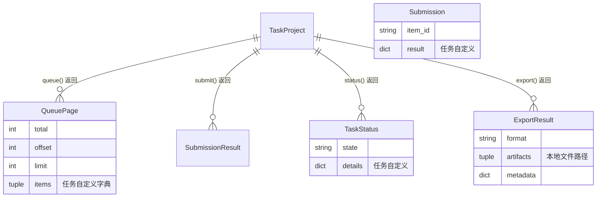

# 通用设计

横切关注点集中在此：数据模型、错误处理、安全、性能、实现约束、测试方针、依赖库。

## 1. 数据模型

### 1.1 平台层通用类型

`TaskTypeModule` 的五个方法交换的都是任务无关的载体类型，定义在
[`task_types.py`](../../backend/annotation_platform/task_types.py)：

`items`/`result`/`details`/`metadata` 内部字段完全由各任务类型模块定义，平台层
（`server.py`、`ProjectRegistry`）不解释，也不因任务类型分支处理。字段级形状见
[`70_外部接口.md`](70_外部接口.md)。

### 1.2 六个内置任务类型各自的存储形态

| 任务类型 | 存储形态 | 说明 |
|---|---|---|
| `classification` / `captioning` / `detection` | 单个 JSON 侧车文件（`schema`/`items`/`history`） | 见对应 `*_task.py` 的 `_read`/`submit` |
| `segmentation` / `depth` | 一个目录：`index.json`（同上结构）+ 每个已标注 item 一张 `<item_id>.png` | 见 [`20_标注平台后端.md`](20_标注平台后端.md) §5 |
| `reid` | 沿用既有 CSV 体系（`candidates.csv` 等） | 见 [`30_ReID流水线.md`](30_ReID流水线.md) |

所有 JSON 侧车文件共享同一个约定：`schema` 版本号、`items`（当前状态，按 `item_id`
索引）、`history`（追加写的操作日志，含时间戳）。

## 2. 错误处理

`TaskTypeError` 是所有任务类型异常的基类，[`task_types.py`](../../backend/annotation_platform/task_types.py)
定义了固定的子类层级，每个子类带一个稳定的 `code` 字符串：

| 异常 | `code` | 触发场景 | HTTP 状态码 |
|---|---|---|---|
| `InvalidTaskTypeModuleError` | `invalid_task_type_module` | 模块未实现协议要求的方法/命名 | （注册期报错，不经 HTTP） |
| `DuplicateTaskTypeError` | `duplicate_task_type` | 两个模块注册同一 `type_name` | （注册期报错） |
| `UnknownTaskTypeError` | `unknown_task_type` | 项目引用了未注册的任务类型 | 500（经 `RegistryError` 包装） |
| `TaskOperationError` | 各模块自定义 | 配置非法、提交内容非法、导出格式不支持 | 422 |
| `TaskConflictError`（`TaskOperationError` 子类） | 各模块自定义 | 同一 item 的重复提交内容不一致 | 409 |

`server.py` 的 `_raise_task_error` 统一把 `TaskConflictError` 映射到 409、其余
`TaskOperationError` 映射到 422，响应体固定为 `{"detail": {"code", "message"}}`。

失败写入不留半成品：所有原子写入原语（见 §4）在异常时删除临时文件，调用方能观察到
的状态只有"写入前"或"写入后"两种。

## 3. 安全设计

- **信任模型**：本地单用户、局域网场景，没有身份认证、没有多用户权限隔离。这是
  产品定位的一部分（见根 [`README.md`](../../README.md)），不是遗漏。
- **CORS**：`server.py` 的 `create_app` 拒绝 `allow_origins` 里出现 `*`，必须显式列出
  来源；默认只允许 `http://localhost:5173`/`http://127.0.0.1:5173`，其余来源通过
  `ANNOTATION_CORS_ORIGINS` 环境变量显式配置（见 [`80_配置参考.md`](80_配置参考.md)）。
- **文件路径遍历防护**：`GET /api/projects/{id}/files/{file_path}` 在拼接路径后用
  `resolve()` + `root not in candidate.parents` 判断是否逃逸出项目根目录，见
  [`server.py`](../../backend/annotation_platform/server.py) `get_project_file`。
- **跨域图像读取**：前端读取深度任务基线图的像素（`loadFromImageElement`）需要
  `Image.crossOrigin = "anonymous"` 且后端 CORS 允许该来源，否则浏览器会把 canvas
  标记为"污染"、拒绝 `getImageData`。见
  [`DepthReviewPage.tsx`](../../frontend/src/tasks/depth/DepthReviewPage.tsx)。

## 4. 性能设计

- **前端像素编辑走原地写**：`raster-buffer.ts` 的 `stampAt`/`strokeSegment`/
  `fillPolygon` 直接原地修改 `Uint8ClampedArray`，不像本仓库其余纯函数模块那样
  每次调用返回全新对象——画笔一次拖拽每帧要调用多次，深拷贝百万像素数组会明显
  卡顿。需要触发 React 重渲染的调用方浅拷贝外层包装对象，不拷贝像素数组本身。
  见 [`40_React前端.md`](40_React前端.md) §5。
- **服务端不解码图像**：检测/分割/深度都不在后端做 JPEG/PNG 解码或尺寸探测——
  图像尺寸由浏览器测量后随请求提交，分割/深度的像素只编码不解码（见 §1、
  [`20_标注平台后端.md`](20_标注平台后端.md) §5）。这既是安全/依赖考量，也是性能
  考量：避免在请求路径上做图像解码。
- **ReID 后台任务串行化**：`jobs.py` 用一个进程级 `threading.Lock`
  （`_EXECUTION_GATE`）保证同一时间只有一个流水线阶段在跑，因为多个阶段会通过
  `sys.stdout` 重定向捕获日志，并发执行会互相污染日志；这是有意的设计约束而非
  未来要修的瓶颈，见 [`30_ReID流水线.md`](30_ReID流水线.md) §4。

## 5. 实现约束

- **`backend/annotation_platform/` 运行时不依赖 Pillow/numpy。** 这是一条延续自
  `reid_annotation_tool` 的既有原则（"审核、检查和定版只需要基础 Python 依赖"）
  向新任务类型的延伸：分割/深度需要的 PNG 编码用
  [`imaging.py`](../../backend/annotation_platform/imaging.py) 手写的极简编码器
  解决，不引入新运行时依赖。`Pillow` 只出现在 `pyproject.toml` 的 `test` extra
  里，仅用于测试断言编码器产出的 PNG 能被真实解码器正确读回。
- **任务类型模块之间不得互相 import 对方的内部实现**——只能通过 `task_types.py`
  的协议类型交互；唯一的例外是 `reid` 任务类型对 `reid_annotation_tool` 包的
  委托（这本来就是两个不同粒度的模块，见 [`30_ReID流水线.md`](30_ReID流水线.md)）。
- **配置校验一律拒绝未知键，不静默忽略。** 每个 `*_task.py` 的 `load_config` 都会
  对 YAML 顶层键做 `set(raw) - CONFIG_KEYS` 检查；`reid_annotation_tool/config.py`
  同样原则更严格（连值域都会校验，见 [`30_ReID流水线.md`](30_ReID流水线.md)）。

## 6. 测试方针

- **后端**：`pytest`，`tmp_path` 构造真实文件系统状态（不 mock 文件系统），
  `backend/tests/conftest.py` 提供 ReID 共用夹具。新任务类型模块的测试固定覆盖：
  队列/提交/状态/导出的正常路径、幂等提交、冲突拒绝、原子写入失败时不留半成品、
  配置校验的表驱动用例。跨模块端到端用 `httpx.ASGITransport` 直接驱动真实
  FastAPI 应用（不用 `TestClient`），见 `backend/tests/test_platform_server.py`。
- **前端**：`vitest` + `@testing-library/react`。纯函数模块（`geometry.ts`、
  `shortcuts.ts`、`box-tool.ts`、`polygon-tool.ts`、`raster-buffer.ts`）各自有不
  依赖 DOM 的单元测试；页面级集成测试集中在 `App.test.tsx`，通过真实路由 + mock
  `fetch` 验证提交请求体的形状。canvas 指针几何在 jsdom 下不可靠，涉及真实拖拽
  交互的验证改为人工起真实 uvicorn + vite 开发服务器、用 headless Chromium 走一遍
  （见 [`00_概述.md`](00_概述.md) §16.1），没有固化为自动化用例。

## 7. 依赖库一览

| 库 | 用途 | 使用方 |
|---|---|---|
| FastAPI / uvicorn | HTTP API 框架与 ASGI 服务器 | `backend/annotation_platform/server.py` |
| PyYAML | 项目与任务配置解析 | 各 `*_task.py`、`reid_annotation_tool/config.py` |
| numpy / opencv-python / onnxruntime | 视频抽取、ReID embedding | `backend[extract]`，仅 `reid_annotation_tool` 使用 |
| ultralytics | 参考检测流水线 | `backend[ultralytics]`，仅 `pipelines/ultralytics.py` |
| httpx / pytest | 后端测试 | `backend[test]` |
| Pillow | 验证 PNG 编码器的输出可被真实解码器读回 | `backend[test]`，仅 `test_imaging.py`，不出现在运行时依赖里 |
| React / wouter | 前端组件与路由 | `frontend/src/` |
| openapi-fetch / openapi-typescript | 从后端 OpenAPI schema 生成类型安全的 API 客户端 | `frontend/src/api/` |
| vite / vitest / @testing-library/react | 前端构建与测试 | `frontend/` |
