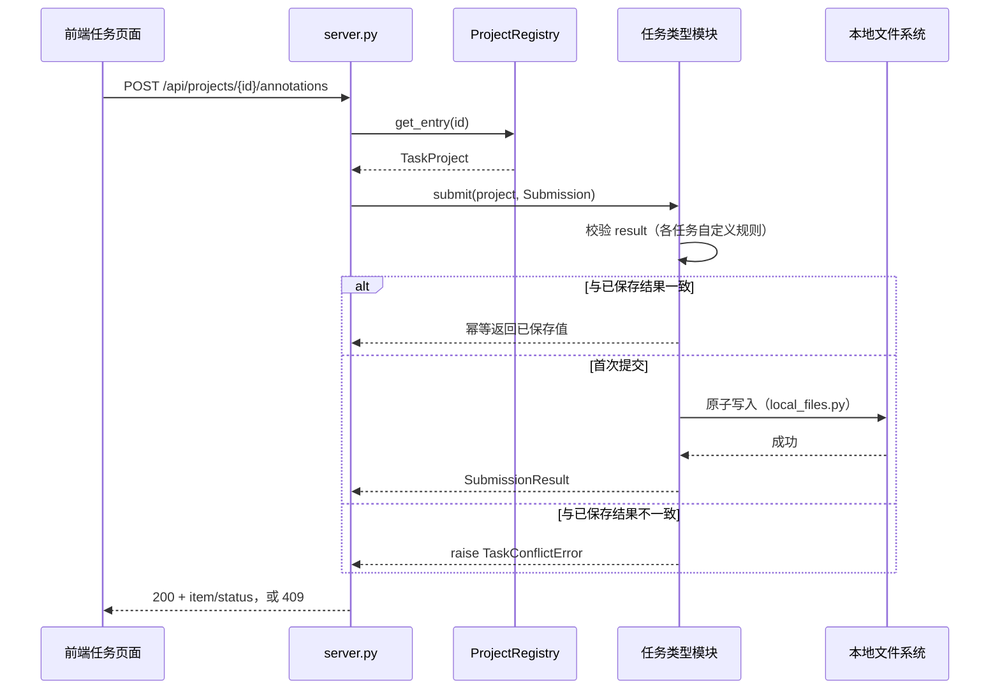

# 标注平台后端

**源码**：[`backend/annotation_platform/`](../../backend/annotation_platform/)

| 文件 | 职责 |
|---|---|
| [`task_types.py`](../../backend/annotation_platform/task_types.py) | `TaskTypeModule`/`TaskActionModule` 协议、`TaskTypeRegistry`、内置注册表 `default_task_types()` |
| [`server.py`](../../backend/annotation_platform/server.py) | FastAPI 应用与全部 HTTP 路由，任务无关 |
| [`local_files.py`](../../backend/annotation_platform/local_files.py) | 原子写入原语（JSON/CSV/字节）与文件级锁 |
| [`imaging.py`](../../backend/annotation_platform/imaging.py) | 极简 8-bit 灰度 PNG 编码器（仅编码，纯标准库） |
| `classification_task.py` / `caption_task.py` / `detection_task.py` / `segmentation_task.py` / `depth_task.py` / `reid_task.py` | 六个内置任务类型模块 |

**运行进程**：单进程 `uvicorn` ASGI 服务；不派生子进程（ReID 后台动作用线程，见
[`30_ReID流水线.md`](30_ReID流水线.md) §4）。

## 1. 职责

把"HTTP 请求"和"某个具体任务类型怎么存储、校验、导出标注结果"这两件事彻底分开。
本子系统**不**实现任何标注 UI，**不**关心浏览器怎么画框/画笔，**不**在多个任务
类型之间共享业务字段——它只保证：任何满足 `TaskTypeModule` 协议的模块，都能通过
同一套 HTTP 路由被前端使用。

## 2. 初始化

`create_app()`（[`server.py`](../../backend/annotation_platform/server.py)）懒加载：
构造时只记录 `registry_path` 和 `task_types`（默认 `default_task_types()`），第一次
收到请求时才用 `ProjectRegistry.load()` 解析 `projects.yaml`。这意味着 `projects.yaml`
在服务运行期间的修改会在下一次请求时生效，不需要重启（但同一次请求内的注册表是
一次性加载的快照）。

## 3. 接口一览

完整规格见 [`70_外部接口.md`](70_外部接口.md)，此处只列职责：

| 方法 & 路径 | 分组 | 作用 |
|---|---|---|
| `GET /api/projects` | 项目 | 列出注册表里的全部项目及其状态 |
| `GET /api/projects/{id}` | 项目 | 单个项目详情，含任务自定义 `summary` |
| `GET /api/projects/{id}/queue` | 队列 | 分页 + 过滤的待处理/已处理 item 列表 |
| `POST /api/projects/{id}/annotations` | 标注 | 提交一个 item 的标注结果 |
| `GET /api/projects/{id}/actions` | 动作 | 列出该任务类型支持的后台动作及历史任务（仅 `TaskActionModule` 实现者） |
| `POST /api/projects/{id}/actions/{action}` | 动作 | 启动一个后台动作 |
| `GET /api/projects/{id}/actions/jobs/{job_id}` | 动作 | 查询一个后台任务的状态 |
| `GET /api/projects/{id}/files/{path}` | 文件 | 读取项目根目录下的任意文件（图片、掩膜 PNG、基线深度图） |

## 4. 核心流程

### 4.1 一次标注提交

失败路径（`TaskOperationError`/`TaskConflictError`）由 `server.py` 的
`_raise_task_error` 统一转换成 HTTP 422/409，见 [`10_通用设计.md`](10_通用设计.md) §2。

## 5. 数据模型 / 关键类型

### 5.1 六个任务类型模块的共同形状

除 `reid_task.py`（对 [`30_ReID流水线.md`](30_ReID流水线.md) 的适配，不重复实现存储）
外，其余五个模块都遵循同一形状：

1. 一个冻结 dataclass 描述已校验的项目配置（如 `ClassificationProject`）。
2. `load_config(path)`：解析 YAML、拒绝未知键、把 `dataset`/`annotations` 等路径
   解析为绝对路径并校验"必须落在 dataset 内部"。
3. 一个 `*Store` 类，持有 `file_lock`，实现 `images()`（发现待标注文件）、
   `_read()`/`submit()`/`status()`/`export()`。
4. 一个 `*TaskType` 类，把 `TaskProject.value` 转型回具体 dataclass 后委托给
   `*Store`——这是唯一实现 `TaskTypeModule` 协议的地方。

### 5.2 JSON 侧车 vs 整图栅格

`classification_task.py`/`caption_task.py`/`detection_task.py` 只写一个 JSON 侧车
文件（`schema`/`items`/`history`），标注结果本身是纯 JSON（标签、文本、box 坐标）。

`segmentation_task.py`/`depth_task.py` 额外写一个像素栅格：`annotations` 配置项
指向一个**目录**（不是文件），目录内是 `index.json` + 每个已标注 item 一张
`<item_id>.png`。这两个任务类型提交的 `result` 里带 base64 编码的整图像素
（`width * height` 字节，每像素一个值），`*Store.submit()` 用
[`imaging.encode_gray8_png`](../../backend/annotation_platform/imaging.py) 编码后
经 `atomic_write_bytes` 落盘；幂等判定比较提交像素的 sha256，不需要解码已保存的
PNG（后端从不解码 PNG，见 [`10_通用设计.md`](10_通用设计.md) §5）。

`depth_task.py` 额外有一个 `depth_maps` 配置项（基线深度图目录），语义与
`annotations` 一样"必须落在 dataset 内部、且自动从 `images()` 的发现结果里排除"
——这是为了避免服务端自己写出的掩膜/深度图 PNG 被同一套 `patterns` 又发现成一张
新的待标注源图（这个坑在 #21 开发过程中真的踩到过一次，两个模块的 `images()`
都显式排除了各自的输出目录）。

字段级 JSON 形状、COCO 兼容导出的具体结构，见 [`70_外部接口.md`](70_外部接口.md)。
配置项的完整参考见 [`80_配置参考.md`](80_配置参考.md)。
