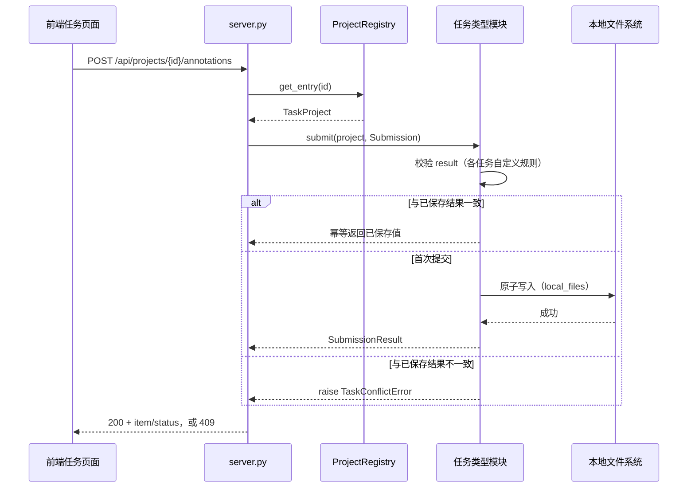

# 标注平台后端

**源码**：[`backend/annotation_platform/`](../../backend/annotation_platform/)

| 文件 | 职责 |
|---|---|
| [`task_types.py`](../../backend/annotation_platform/task_types.py) | `TaskTypeModule`/`TaskActionModule` 协议、`TaskTypeRegistry`、内置注册表 `default_task_types()` |
| [`server.py`](../../backend/annotation_platform/server.py) | FastAPI 应用与全部 HTTP 路由，任务无关 |
| [`project_registry.py`](../../backend/annotation_platform/project_registry.py) | 项目注册表 `ProjectRegistry`：解析 `projects.yaml`、按 `task_type` 选模块并调用其 `load()`、拒绝重复 id 与共享数据集根目录 |
| [`workspace.py`](../../backend/annotation_platform/workspace.py) | 工作区：注册表读写、项目目录的创建/删除、属性与原始配置的校验写入、图片上传/zip 导入/目录关联、导出下载 |
| [`project_forms.py`](../../backend/annotation_platform/project_forms.py) | 各任务类型的属性表单定义（`FieldSpec`）与按表单的取值、类型检查、`lock`/`server_only` 规则 |
| [`imaging.py`](../../backend/annotation_platform/imaging.py) | 极简 8-bit 灰度 PNG 编码器（仅编码，纯标准库） |
| [`image_dataset.py`](../../backend/annotation_platform/image_dataset.py) | 除 ReID 外各任务（读本地文件目录的任务）共用的配置解析、文件发现与 `item_id`、侧车读写、队列过滤与状态判定、载荷校验，以及 `ImageTaskStore`/`ImageTaskType` 基类（§5.1） |
| `classification_task.py` / `caption_task.py` / `text_span_task.py` / `detection_task.py` / `segmentation_task.py` / `polygon_task.py` / `depth_task.py` / `reid_task.py` | 内置任务类型模块 |
| `file_kinds.py` | 源文件类别（图片/文本/JSON）的判定、UTF-8 文本读取与上传内容校验 |
| `export_contracts.py` | 版本化导出契约：每个 `(任务类型, format)` 的契约名、版本与校验器；`Workspace.export()` 下载前用它校验 |
| `exports.py` | 命令行导出与契约校验（`python -m annotation_platform.exports`，安装后为 `annotation-export`） |

**运行进程**：单进程 `uvicorn` ASGI 服务；不派生子进程（ReID 后台动作用线程，见
[`30_ReID流水线.md`](30_ReID流水线.md) §4）。

## 1. 职责

把"HTTP 请求"和"某个具体任务类型怎么存储、校验、导出标注结果"这两件事彻底分开。
本子系统**不**实现任何标注 UI，**不**关心浏览器怎么画框/画笔，**不**在多个任务
类型之间共享业务字段——它只保证：任何满足 `TaskTypeModule` 协议的模块，都能通过
同一套 HTTP 路由被前端使用。

## 2. 初始化

`create_app()`（[`server.py`](../../backend/annotation_platform/server.py)）懒加载：
构造时只建立一个 `Workspace`（只计算路径：工作区目录、`projects.yaml`、
`ANNOTATION_IMPORT_ROOTS`，**不创建任何文件或目录**——
`frontend/scripts/export_openapi.py` 也会构造应用）和 `task_types`（默认
`default_task_types()`），每次收到请求时才用 `ProjectRegistry.load()` 解析
`projects.yaml`。这意味着 `projects.yaml` 在服务运行期间的修改会在下一次请求时生效，
不需要重启（但同一次请求内的注册表是一次性加载的快照）。工作区目录下还没有
`projects.yaml` 时视为空注册表；`create_app` 的第一个参数是 `.yaml`/`.yml` 文件
（或任何已存在的文件）时，按旧方式把它当作注册表本身，此时文件缺失仍是
`registry_invalid`。

## 3. 接口一览

完整规格见 [`70_外部接口.md`](70_外部接口.md)，此处只列职责：

| 方法 & 路径 | 分组 | 作用 |
|---|---|---|
| `GET /api/projects` | 项目 | 列出注册表里的全部项目及其状态 |
| `GET /api/projects/{id}` | 项目 | 单个项目详情，含任务自定义 `summary` |
| `GET /api/projects/{id}/queue` | 队列 | 分页 + 过滤的待处理/已处理 item 列表 |
| `POST /api/projects/{id}/annotations` | 标注 | 提交一个 item 的标注结果 |
| `GET /api/projects/{id}/actions` | 动作 | 列出该任务类型支持的后台动作及历史任务（仅 `TaskActionModule` 实现者） |
| `POST /api/projects/{id}/actions/{action}` | 动作 | 启动一个后台动作 |
| `GET /api/projects/{id}/actions/jobs/{job_id}` | 动作 | 查询一个后台任务的状态 |
| `GET /api/projects/{id}/files/{path}` | 文件 | 读取项目根目录下的任意文件（图片、掩膜 PNG、基线深度图） |
| `GET /api/task-types` | 管理 | 可创建的任务类型与属性表单定义 |
| `POST /api/projects`、`DELETE /api/projects/{id}` | 管理 | 创建 / 删除项目 |
| `GET`/`PUT /api/projects/{id}/settings`、`PUT /api/projects/{id}/config` | 管理 | 读取与修改项目属性（表单或原始 YAML） |
| `POST /api/projects/{id}/import/{files,archive,directory}` | 管理 | 上传图片、导入 zip、关联服务器目录 |
| `GET /api/projects/{id}/export` | 管理 | 调用 `export()` 并以下载返回 |

## 4. 核心流程

### 4.1 一次标注提交

```mermaid
sequenceDiagram
    participant FE as 前端任务页面
    participant API as server.py
    participant Reg as ProjectRegistry
    participant Mod as 任务类型模块
    participant FS as 本地文件系统

    FE->>API: POST /api/projects/{id}/annotations
    API->>Reg: get_entry(id)
    Reg-->>API: TaskProject
    API->>Mod: submit(project, Submission)
    Mod->>Mod: 校验 result（各任务自定义规则）
    alt 与已保存结果一致
        Mod-->>API: 幂等返回已保存值
    else 首次提交
        Mod->>FS: 原子写入（local_files）
        FS-->>Mod: 成功
        Mod-->>API: SubmissionResult
    else 与已保存结果不一致
        Mod-->>API: raise TaskConflictError
    end
    API-->>FE: 200 + item/status，或 409
```

失败路径（`TaskOperationError`/`TaskConflictError`）由 `server.py` 的
`_raise_task_error` 统一转换成 HTTP 422/409，见 [`10_通用设计.md`](10_通用设计.md) §2。

### 4.2 项目管理（工作区）

项目只通过 Web 界面管理。`server.py` 的管理路由都很薄，逻辑集中在
[`workspace.py`](../../backend/annotation_platform/workspace.py) 的 `Workspace`：

- **创建**：按名称生成 id（小写 ASCII slug，重名加 `-2`…；同时避开已存在的目录），
  在注册表锁内建 `projects/<id>/` 与 `data/`，按表单值写 `config.yaml`，交给任务模块
  `load()` 校验，最后追加注册表条目。任何一步失败都删除刚建的目录，注册表不变。
- **校验写入**（`_write_validated`）：候选配置先写到同目录的
  `config.yaml.validate.tmp`（相对路径解析结果与正式文件一致），模块 `load()` 通过后
  才原子替换。模块是配置合法性的唯一权威，`project_forms.py` 的表单定义只做类型
  检查和锁规则，不能让非法配置通过。
- **锁规则**：`status()` 显示已有标注时，`append_only` 字段只能在末尾追加（分割像素值
  与 COCO `category_id` 按列表位置编号），`locked` 字段不能改。
- **`server_only`**：ReID 的训练器/评估器目录及其 Python 解释器是平台会执行的程序；
  API 无认证，可改即远程代码执行，所以表单和原始配置都不能改它们，原始配置也只能把
  `pipeline.script` 设为内置流水线名；`extract.out`、`mine.output_dir`、
  `train`/`evaluate` 的 `set`/`base_config` 同理（`TaskTypeSpec.server_only_keys`）。
  模型/权重路径不能指向 `<workspace>/projects/`（`Workspace._check_model_paths`）：
  那里的内容可经 API 上传，而 torch 权重是 pickle。
- **数据来源**：托管模式（`dataset` 为 `projects/<id>/data`）接受图片上传和 zip 导入，
  请求体流式写入同目录临时文件，校验文件头是 JPEG/PNG/WebP 签名后改名，扩展名统一
  存为小写；路径中任何以 `.` 开头的段都被拒绝，保护 `.annotations` 等平台目录。关联目录模式把 `dataset` 改成服务器上已有目录的绝对
  路径，范围限于工作区与 `ANNOTATION_IMPORT_ROOTS`（因为文件端点会提供数据集根目录下
  的任意文件），并在写入前检查数据集根目录不与其他项目重复（否则整个注册表会失效）。
- **删除**：先移除注册表条目，再删除 `projects/<id>/`；关联目录与手写注册表时代的
  项目文件从不删除。
- **导出**：单个产物直接以 `FileResponse` 下载，多个产物（分割/深度 `native`）在
  线程池里打成临时 zip，响应发送后由 `BackgroundTask` 删除。

所有写操作在 `projects.yaml` 的 `file_lock` 下串行；zip 解压与导出打包放在线程池
执行，不阻塞事件循环。

## 5. 数据模型 / 关键类型

### 5.1 任务类型模块的共同形状

除 `reid_task.py`（对 [`30_ReID流水线.md`](30_ReID流水线.md) 的适配，不重复实现存储）
外，其余模块都建立在平台级共享模块
[`image_dataset.py`](../../backend/annotation_platform/image_dataset.py) 上。

**共享部分（只此一份）**：

- 配置：`read_config`（读 YAML、拒绝未知键、解析 `dataset`）、`config_patterns`
  （`patterns` 不得越出 dataset）、`dataset_relative`（`annotations`/`depth_maps`
  等必须落在 dataset 内部）、`text_list`（非空、去空白、不重复的文本列表）、
  `DEFAULT_PATTERNS`。
- 文件发现与标识：`discover_images`（可排除任务自己的输出与基线目录）、
  `item_id`（数据集相对路径的 sha256 前 16 位，持久化在侧车中）。
- `ImageTaskStore` 基类：侧车文档 `{schema, items, history}` 的读取与逐项校验、
  队列的 `status`/`q` 过滤与分页、状态判定（词汇 `STATUS_*` 定义在
  `task_types.py`，ReID 共用）、原生导出时补写空侧车。队列 `status` 过滤只接受
  `pending`（未标注）与 `annotated`（已标注），其他值 422。
- 通用载荷校验：`finite_number`、`image_size`、`pixels`。
- `ImageTaskType` 基类：`TaskTypeModule` 协议的统一实现（`load` 及四个委托）。

**任务专属部分（各模块保留）**：配置 dataclass 与 `load_config`（组合上述函数、
加上自己的键，如分类的 `labels`/`mode`、分割的类别上限 254）；`*Store` 子类的
`valid_item`（侧车中一个 item 的专属字段形状）、`item_view`（队列 item 形状）、
`status_fields`（状态摘要中的专属字段）、`submit`（结果语义与幂等比较）与
`export`；`*TaskType` 子类只声明 `type_name`、`project_type`、`store_type`、
`config_loader`。

### 5.2 JSON 侧车 vs 整图栅格

`classification_task.py`/`caption_task.py`/`text_span_task.py`/`detection_task.py`/`polygon_task.py` 只写一个 JSON 侧车
文件（`schema`/`items`/`history`），标注结果本身是纯 JSON（标签、文本、box 坐标）。

`classification`/`captioning` 的条目可以是图片，也可以是 UTF-8 文本文档（#39）：
`patterns` 匹配到的非图片文件按文本处理，由
[`file_kinds.py`](../../backend/annotation_platform/file_kinds.py) 严格解码（BOM 去掉、
换行原样保留、大小上限 `MAX_DOCUMENT_BYTES`）。`ImageTaskStore.media_fields()` 把
`media`/`text`/`text_error` 放进队列条目，`submittable_path()` 拒绝为无法解码的文本
保存结果。文本复用同一套队列、原子写入、历史与导出，侧车 schema 不变。上传按
`TaskTypeSpec.upload_kinds` 接受图片/文本/JSON，内容按扩展名所属类别校验
（`file_kinds.has_kind_content()`）。

`segmentation_task.py`/`depth_task.py` 额外写一个像素栅格：`annotations` 配置项
指向一个**目录**（不是文件），目录内是 `index.json` + 每个已标注 item 一张
`<item_id>.png`。这两个任务类型提交的 `result` 里带 base64 编码的整图像素
（`width * height` 字节，每像素一个值），`*Store.submit()` 用
[`imaging.encode_gray8_png`](../../backend/annotation_platform/imaging.py) 编码后
经 `atomic_write_bytes` 落盘；幂等判定比较提交像素的 sha256，不需要解码已保存的
PNG（后端从不解码 PNG，见 [`10_通用设计.md`](10_通用设计.md) §5）。

`depth_task.py` 额外有一个 `depth_maps` 配置项（基线深度图目录），语义与
`annotations` 一样"必须落在 dataset 内部、且自动从 `images()` 的发现结果里排除"
——这是为了避免服务端自己写出的掩膜/深度图 PNG 被同一套 `patterns` 又发现成一张
新的待标注源图（这个坑在 #21 开发过程中真的踩到过一次，两个模块的 `images()`
都显式排除了各自的输出目录）。

### 5.3 可修订结果与只读预标（`polygon_task.py`）

`polygon` 是唯一允许修改已提交结果的任务（#41，需求 FR-019）：侧车 item 带
`revision`，提交带 `base_revision`，在侧车文件锁内比较——等价结果幂等，基于当前版本
则覆盖并追加历史，否则 `TaskConflictError`。其余任务仍按 FR-007"不同结果即冲突"。

预标文件在 `PolygonStore.prelabels()` 中按需解析（每个请求一次），**不在 `load()`
里解析**：`load()` 失败会让整个注册表加载失败、所有项目都打不开，而预标文件是在项目
创建之后才上传、可能随时被替换的数据。解析结果分三类：整份文件不可用
（`PrelabelFileError`，项目 `invalid`）、某张图不可用（整图不加载并逐条报告原因）、
某条 annotation 不指向任何图（单独报告）。预标文件路径加入 `excluded()`，永远不会
成为源图。COCO 导出时透传预标 `images[]` 的额外字段。

字段级 JSON 形状、COCO 兼容导出的具体结构，见 [`70_外部接口.md`](70_外部接口.md)。
配置项的完整参考见 [`80_配置参考.md`](80_配置参考.md)。
