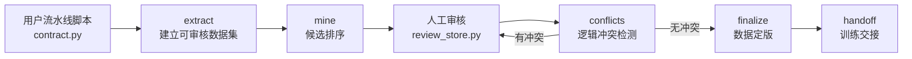
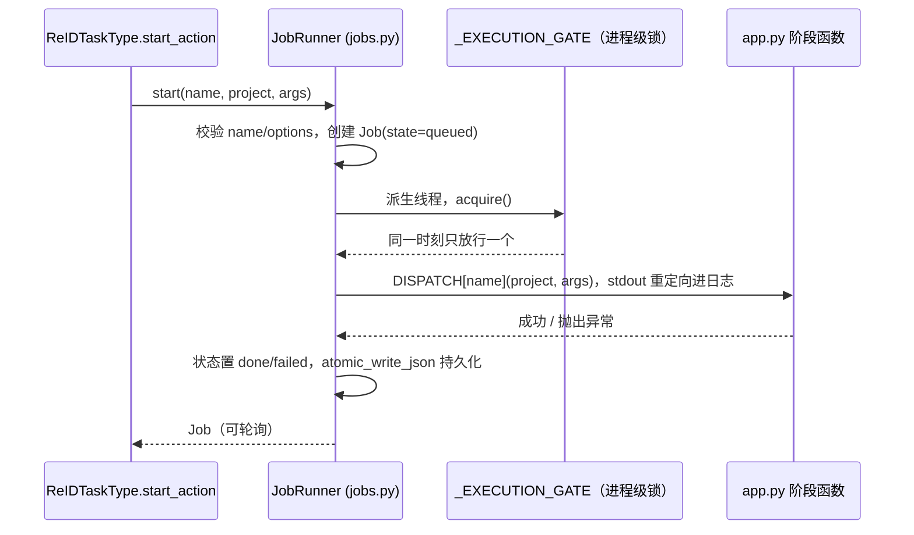

# ReID 流水线

**源码**：[`backend/reid_annotation_tool/`](../../backend/reid_annotation_tool/)

| 文件 | 一句话职责 |
|---|---|
| [`app.py`](../../backend/reid_annotation_tool/app.py) | 单一 CLI 入口，`DISPATCH` 表把子命令映射到各阶段函数 |
| [`config.py`](../../backend/reid_annotation_tool/config.py) | `reid.yaml` 的分节校验与默认值 |
| [`contract.py`](../../backend/reid_annotation_tool/contract.py) | 用户流水线脚本与本工具之间的边界约定 |
| [`extract.py`](../../backend/reid_annotation_tool/extract.py) | 把用户流水线的跟踪输出转成可审核的数据集 |
| [`geometry.py`](../../backend/reid_annotation_tool/geometry.py) | 裁剪框几何与画质判定 |
| [`projection.py`](../../backend/reid_annotation_tool/projection.py) | 头部框 → 身体框的透视换算 |
| [`tracker.py`](../../backend/reid_annotation_tool/tracker.py) | 确定性 IoU 跟踪器（供参考流水线使用） |
| [`detector.py`](../../backend/reid_annotation_tool/detector.py) / [`embed.py`](../../backend/reid_annotation_tool/embed.py) | 参考流水线的检测器封装 / ONNX ReID embedding |
| [`mine.py`](../../backend/reid_annotation_tool/mine.py) | 用粗糙模型给人工审核候选排序 |
| [`core.py`](../../backend/reid_annotation_tool/core.py) | 清单、审核标签、身份约束的基础读写原语 |
| [`review_store.py`](../../backend/reid_annotation_tool/review_store.py) | 审核队列访问 + 原子 CSV 标签持久化（平台 API 与 CLI 共用） |
| [`conflicts.py`](../../backend/reid_annotation_tool/conflicts.py) | 身份关系图上的逻辑冲突检测 |
| [`domain.py`](../../backend/reid_annotation_tool/domain.py) | 跨天/跨相机关系归档（同日同机位约束） |
| [`provenance.py`](../../backend/reid_annotation_tool/provenance.py) | 每条关系判定的溯源展开 |
| [`revision.py`](../../backend/reid_annotation_tool/revision.py) | Web 端修订已有人工判定（最新判定覆盖旧判定） |
| [`registry.py`](../../backend/reid_annotation_tool/registry.py) | 命名的 PyTorch checkpoint 注册表 |
| [`handoff.py`](../../backend/reid_annotation_tool/handoff.py) | 把定版数据集交给外部训练脚本，记录交接内容 |
| [`jobs.py`](../../backend/reid_annotation_tool/jobs.py) | 后台任务执行器：一次一个，包装 `app.py` 的阶段函数 |
| [`project_registry.py`](../../backend/reid_annotation_tool/project_registry.py) | 多项目注册表（被 [`20_标注平台后端.md`](20_标注平台后端.md) 复用） |
| [`pipelines/`](../../backend/reid_annotation_tool/pipelines/) | 参考流水线脚本（`tracking_csv.py`、`ultralytics.py`），仅供复制，不是自动默认 |

**运行进程**：CLI 直接调用时是前台脚本；作为平台的 `reid` 任务类型使用时，重量级
阶段（`extract`/`mine`/`check`/`finalize`/`purge-domain`/`train`）由
[`jobs.py`](../../backend/reid_annotation_tool/jobs.py) 派生的后台线程执行。

## 1. 职责

把"别人的检测+跟踪结果"变成"可审核、可定版、可训练"的 ReID 数据集。**本工具不做
目标检测、身份分配或轨迹跟踪**——这三件事由用户自己的流水线脚本负责（见
[`contract.py`](../../backend/reid_annotation_tool/contract.py)）；模型在这里只能
给候选排序，不能把相似度直接当身份真值（低精度部署约束见
`backend/README.md` §低精度约束）。

## 2. 生命周期

`reid.yaml` 一个文件贯穿全部阶段，`dataset:` 字段决定所有路径的推导起点：

完整的阶段命令、`reid.yaml` 各节归属和低精度部署约束见 `backend/README.md`（本文档
不重复，理由见 [`00_概述.md`](00_概述.md) §1.1）。

## 3. 接口一览

作为平台任务类型使用时，ReID 通过 `ReIDTaskType`
（[`reid_task.py`](../../backend/annotation_platform/reid_task.py)，属于
[`20_标注平台后端.md`](20_标注平台后端.md) 子系统）适配到标准的
`load/queue/submit/status/export` 五个方法，`submit`/`queue` 直接委托给
[`review_store.py`](../../backend/reid_annotation_tool/review_store.py)；额外的
`TaskActionModule` 六个后台动作完整规格见 [`70_外部接口.md`](70_外部接口.md)。

## 4. 核心流程：后台动作执行

一次一个任务是有意的设计约束，不是待优化的瓶颈：多个阶段共享 `sys.stdout` 重定向
捕获日志，并发执行会互相污染彼此的日志；这些阶段本身也是"整机"级操作。见
[`10_通用设计.md`](10_通用设计.md) §4。任务历史持久化在 `<dataset>/.jobs/`，进程
重启后仍能追溯，中途被打断的任务会在下次加载时标记为 `failed`。

## 5. 已迁移功能：旧 CLI 用户的路径速查

仓库重组（#9）把原来仓库根目录下的一切都移进了 `backend/`：

| 旧路径/命令 | 新路径/命令 |
|---|---|
| `python app.py ...` | `python backend/app.py ...`（或 `cd backend && python app.py ...`） |
| `pip install -e .` | `pip install -e backend` |
| `configs/*.yaml`、`pipeline/` | `backend/configs/*.yaml`、`backend/pipeline/` |
| `python app.py serve` + 标准库 HTTP 页面 | 已移除，改用 `uvicorn annotation_platform.server:app --app-dir backend`（见根 [`README.md`](../../README.md) 快速开始） |

`reid.yaml` 内部字段的迁移（旧版一长串 CLI flag、`train:` 节里训练器专属超参的
搬迁）已经写在 `backend/README.md` 对应小节，不在此重复。
