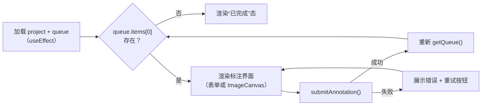

# React 前端

**源码**：[`frontend/src/`](../../frontend/src/)

| 目录/文件 | 职责 |
|---|---|
| [`App.tsx`](../../frontend/src/App.tsx) | `wouter` 路由表：项目列表/详情 + 各任务标注页面的固定路径 |
| [`api/client.ts`](../../frontend/src/api/client.ts) | 基于生成的 OpenAPI 类型（`api/schema.d.ts`）的类型安全 API 客户端 |
| [`components/image-canvas/`](../../frontend/src/components/image-canvas/) | 与具体任务无关的共享画布图元（§5） |
| [`components/AsyncState.tsx`](../../frontend/src/components/AsyncState.tsx) | 通用加载中/错误态展示组件 |
| [`pages/`](../../frontend/src/pages/) | 项目列表、项目详情（按 `task_type` 分支渲染各任务的入口链接）、画布 demo |
| [`tasks/<type>/`](../../frontend/src/tasks/) | 每种任务类型一个目录，一个 `*ReviewPage.tsx` |
| [`tasks/useImageSize.ts`](../../frontend/src/tasks/useImageSize.ts) | 检测/分割/深度共用：提交前用一张隐藏 `Image` 预探测图片像素尺寸 |

**运行进程**：浏览器；开发时由 Vite 提供，生产构建产物由任意静态文件服务器托管
（本项目未内置生产部署脚本，见 [`90_部署与运维.md`](90_部署与运维.md)）。

## 1. 职责

把六种任务类型的标注交互统一到"读队列 → 在画布/表单里产出一个 `result` → 提交 →
读下一条"这一个循环里，同时让检测/分割/深度三个基于画布的任务类型共享同一套坐标
变换、图层合成和像素编辑图元，不各自维护一份。前端**不**做任何服务端已经做的
校验重复实现——`result` 的合法性以后端 422/409 响应为准，前端校验只是提前拦截
明显无效的输入以改善体验。

## 2. 路由与项目详情分发

`App.tsx` 按固定路径把每种 `task_type` 映射到一个页面组件（`/projects/:id/classify`、
`/caption`、`/detect`、`/segment`、`/depth`、`/review`）；`ProjectDetailPage.tsx`
读到项目的 `task_type` 后渲染对应的入口链接。新增任务类型需要同时改这两处——没有
从 `task_type` 到路由的自动派生。

## 3. 接口一览

前端只消费 [`70_外部接口.md`](70_外部接口.md) 描述的通用端点
（`queue`/`annotations`/`files`/`actions`），不存在任务类型专属的 HTTP 端点；
`api/client.ts` 的函数签名对全部任务类型通用，`result`/`summary` 字段类型是
`Record<string, unknown>`。

## 4. 核心流程：一个任务页面的标准循环

`ClassificationReviewPage.tsx`/`CaptionReviewPage.tsx` 没有画布，直接照此流程；
`DetectionReviewPage.tsx`/`SegmentationReviewPage.tsx`/`DepthReviewPage.tsx` 在
"渲染标注界面"这一步额外挂载 `ImageCanvas` + 对应的画布图元。

## 5. 共享图像画布图元（`components/image-canvas/`）

坐标系、图层合成、指针事件和快捷键的完整契约见该目录自己的
[`README.md`](../../frontend/src/components/image-canvas/README.md)（本文档不重复，
理由见 [`00_概述.md`](00_概述.md) §1.1）。三个画布任务各自复用的图元：

| 图元 | 被谁用 | 关键点 |
|---|---|---|
| `geometry.ts` / `shortcuts.ts` | 全部三个画布任务 | 视口缩放/平移的纯函数，快捷键绑定与冲突检测 |
| `box-tool.ts` | 检测 | 创建/选中/移动/8 向 handle 缩放/删除检测框的纯函数状态机 |
| `polygon-tool.ts` | 分割 | 顶点增删/闭合/撤销的纯状态机，只管矢量顶点 |
| `raster-buffer.ts` | 分割 + 深度 | 可原地绘制的 `Uint8ClampedArray` 像素缓冲区：`stampAt`/`strokeSegment`（画笔）、`fillPolygon`（多边形栅格化）、`toBase64`（提交）、`loadFromImageElement`/`toImageData`（读取已有 PNG、渲染预览） |

`polygon-tool.ts` 产出的多边形闭合后会立即调用 `raster-buffer.ts` 的 `fillPolygon`
栅格化进同一张像素缓冲区——**多边形只是画布上的一种作画方式，不是提交给后端的
第二种数据表示**（后端只接受整图栅格，见 [`20_标注平台后端.md`](20_标注平台后端.md) §5）。
`raster-buffer.ts` 的写操作原地修改数据而不是返回新对象，性能考量见
[`10_通用设计.md`](10_通用设计.md) §4。

深度任务额外需要 `loadFromImageElement` 从已获取的基线深度图水合初始像素缓冲区；
该图片元素必须设置 `crossOrigin = "anonymous"`，否则前后端不同源时画布会被浏览器
标记为"污染"、无法读取像素，见 [`10_通用设计.md`](10_通用设计.md) §3。
