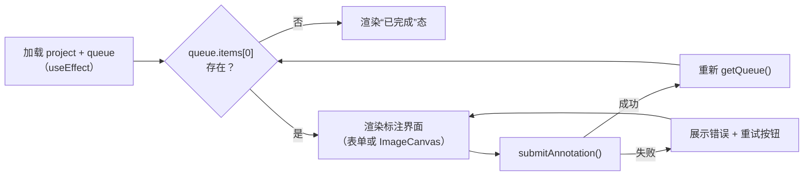

# React 前端

**源码**：[`frontend/src/`](../../frontend/src/)

| 目录/文件 | 职责 |
|---|---|
| [`App.tsx`](../../frontend/src/App.tsx) | 左侧导航 + 右侧工作区的外壳，`wouter` 路由表（§2） |
| [`api/client.ts`](../../frontend/src/api/client.ts) | 基于生成的 OpenAPI 类型（`api/schema.d.ts`）的类型安全 API 客户端 |
| [`components/shell/`](../../frontend/src/components/shell/) | 侧边导航（`SideNav`）、新建项目的任务类型弹窗、全局项目列表上下文（`ProjectsContext`）、线条图标 |
| [`components/settings/`](../../frontend/src/components/settings/) | 按后端字段描述（`/api/task-types` 的 `fields`）渲染的通用属性表单 |
| [`components/AsyncState.tsx`](../../frontend/src/components/AsyncState.tsx) | 通用加载中/错误态展示组件 |
| [`project-meta.ts`](../../frontend/src/project-meta.ts) | 状态/任务类型的中文名、任务入口路径、由 `summary` 计算进度 |
| [`pages/`](../../frontend/src/pages/) | 首页（新建项目入口）、新建项目属性页、画布 demo |
| [`pages/project/`](../../frontend/src/pages/project/) | 项目 dashboard：概览、导入数据、属性、导出 |
| [`img-annotation/`](../../frontend/src/img-annotation/) | 标注工具，按工具类别分层（见下表）；[`pages.ts`](../../frontend/src/img-annotation/pages.ts) 是任务类型 → 标注页的路由表 |

标注工具源码按工具类别分层（新增一类工具时在 `img-annotation/` 下新开一个目录，
如以后的 `3dbbox/`；某类工具专用的代码不放进 `common/`）：

| 目录 | 内容 |
|---|---|
| [`img-annotation/common/`](../../frontend/src/img-annotation/common/) | 各类工具共用：[`image-canvas/`](../../frontend/src/img-annotation/common/image-canvas/)（与任务无关的画布图元，§5）、[`workspace/`](../../frontend/src/img-annotation/common/workspace/)（工作台布局、工具栏、撤销/重做、页面级快捷键 `useHotkeys`、类别配色，§6）、`useTaskQueue`（队列循环，§4）、`ImageStrip`（图像列表）、`ItemStage`（图片/文本舞台）、`useImageSize`（预探测图片像素尺寸） |
| [`img-annotation/standard/`](../../frontend/src/img-annotation/standard/) | 通用传统标注：`classification/`、`caption/`、`detection/`、`segmentation/`、`polygon/`、`text-span/`（含纯函数 `text-span.ts`），各一个 `*ReviewPage.tsx` |
| [`img-annotation/reid/`](../../frontend/src/img-annotation/reid/) | ReID / 相似度成对审核页与项目页上的 ReID 动作面板 |
| [`img-annotation/depth/`](../../frontend/src/img-annotation/depth/) | 深度图标注页 |

**运行进程**：浏览器；开发时由 Vite 提供，生产构建产物可由后端通过
`ANNOTATION_FRONTEND_DIST` 同源托管（Docker 镜像即如此），也可由任意静态文件服务器
托管，见 [`90_部署与运维.md`](90_部署与运维.md)。

## 1. 职责

把各任务类型的标注交互统一到"读队列 → 在画布/表单里产出一个 `result` → 提交 →
读下一条"这一个循环里，同时让检测/分割/深度三个基于画布的任务类型共享同一套坐标
变换、图层合成和像素编辑图元，不各自维护一份。前端**不**做任何服务端已经做的
校验重复实现——`result` 的合法性以后端 422/409 响应为准，前端校验只是提前拦截
明显无效的输入以改善体验。

## 2. 页面结构与路由

页面左右分割：左侧窄导航（可收起为图标栏，窄屏下固定为图标栏）放"新建项目"按钮和
项目列表，当前项目下展开"概览 / 导入数据 / 标注 / 属性 / 导出"；右侧为工作区。
项目只能在界面中创建和管理（后端工作区模型见 [`80_配置参考.md`](80_配置参考.md)）。

| 路径 | 页面 |
|---|---|
| `/` | 首页：只有"新建项目"入口，项目从导航进入 |
| （弹窗） | 选择标注任务类型，确认后进入 `/new/<type>` |
| `/new/:taskType` | 新建项目属性页：名称 + 该任务类型的字段，创建后进入概览 |
| `/projects/:id` | 概览（dashboard）：进度、下一步操作卡片、任务摘要；ReID 另有流水线动作 |
| `/projects/:id/import` | 导入数据：上传文件/文件夹/ZIP（托管目录，可接受的扩展名来自 `upload_extensions`），或关联服务器目录 |
| `/projects/:id/settings` | 属性：字段表单、直接编辑配置文件、删除项目 |
| `/projects/:id/export` | 导出：按任务类型可用的格式下载 |
| `/projects/:id/classify` 等 | 标注页面（`/classify`、`/caption`、`/spans`、`/detect`、`/segment`、`/polygon`、`/depth`、`/review`），全宽布局 |

属性表单不在前端硬编码字段：`SettingsForm` 按 `/api/task-types` 返回的 `fields`
渲染，字段的 `lock`（已有标注后 `append_only`/`locked`）与 `server_only`（只读）
在前端只用于提示和禁用，最终由后端校验。

`task_type` 到路由路径、名称与入口文案的映射只在 `project-meta.ts` 的
`taskEntries` 定义一次：导航、概览页的入口链接和 `App.tsx` 的标注页路由都由它生成。
每种任务的页面组件登记在 `img-annotation/pages.ts` 的 `taskPages`，它以 `TaskType`
（`taskEntries` 的键）为键，漏登记或多登记都无法通过类型检查。新增任务类型 = 在
`taskEntries` 加一行 + 在 `taskPages` 登记页面。

## 3. 接口一览

前端只消费 [`70_外部接口.md`](70_外部接口.md) 描述的通用端点
（`queue`/`annotations`/`files`/`actions`，以及项目管理的 `task-types`/`settings`/
`config`/`import`/`export`），不存在任务类型专属的 HTTP 端点；
`api/client.ts` 的函数签名对全部任务类型通用，`result`/`summary` 字段类型是
`Record<string, unknown>`。

## 4. 核心流程：一个任务页面的标准循环

```mermaid
flowchart LR
    Load["加载 project + queue<br/>（useEffect）"] --> Item{"queue.items[0]<br/>存在？"}
    Item -- 否 --> Done["渲染“已完成”态"]
    Item -- 是 --> Render["渲染标注界面<br/>（表单或 ImageCanvas）"]
    Render --> Submit["submitAnnotation()"]
    Submit -- 成功 --> Reload["重新 getQueue()"]
    Submit -- 失败 --> ShowError["展示错误 + 重试按钮"]
    Reload --> Item
    ShowError --> Render
```

这个循环只实现一次：`img-annotation/common/useTaskQueue.tsx` 的 `useTaskQueue(projectId, { taskType,
wrongType, onLoad })` 并行读取项目与待处理队列、拒绝其他任务类型的项目、在提交成功后
重新读取队列，并持有 `submitting`/`submitError`；`QueueFallback` 渲染加载、错误（可
重试）与"已完成"三种状态；`itemText`、`summaryStrings` 是读取队列项与项目摘要的共享
helper。各任务页只负责自己的标注状态、`onLoad` 时的重置与提交的 `result` 形状。

`ClassificationReviewPage.tsx`/`CaptionReviewPage.tsx` 没有画布；
`DetectionReviewPage.tsx`/`SegmentationReviewPage.tsx`/`DepthReviewPage.tsx` 在
"渲染标注界面"这一步额外挂载 `ImageCanvas` + 对应的画布图元。

## 5. 共享图像画布图元（`img-annotation/common/image-canvas/`）

坐标系、图层合成、指针事件和快捷键的完整契约见该目录自己的
[`README.md`](../../frontend/src/img-annotation/common/image-canvas/README.md)（本文档不重复，
理由见 [`00_概述.md`](00_概述.md) §1.1）。三个画布任务各自复用的图元：

| 图元 | 被谁用 | 关键点 |
|---|---|---|
| `geometry.ts` / `shortcuts.ts` | 全部三个画布任务 | 视口缩放/平移的纯函数，快捷键绑定与冲突检测 |
| `box-tool.ts` | 检测 + 多边形 | 创建/选中/移动/8 向 handle 缩放/删除框的纯函数状态机；`createBoxes` 从已保存结果建框 |
| `shape-eraser.ts` | 检测 + 多边形 | 关键点类型 `KeyPoint` 与 `hitTestKeyPoint`；矢量橡皮 `erasePoints`/`erasePolygons`/`eraseBoxes`（及组合 `eraseAt`）：圆内的关键点删除；圆内的多边形顶点删除、剩余顶点按原顺序围成多边形（不足 3 点则删除整个多边形）；圆碰到边框的框删除（在大框内部擦点不会误删框）。未变化的列表保持同一引用，便于页面跳过更新 |
| `polygon-tool.ts` | 分割 + 多边形 | 顶点绘制/闭合/撤销，以及顶点编辑：`pointerDownEdit`（按下时依次尝试抓顶点、在选中多边形的边上插入顶点、选中多边形、取消选中）、`dragVertexTo`（限制在图内）、`insertVertex`、`deleteVertex`（至少保留 3 点）、`relabelPolygon`、`hitTest*`，全部是纯函数，分割页可直接复用 |
| `raster-brush.ts` | 分割 + 深度 | `drawRaster`（把栅格画进图层）与 `useRasterBrush`（画笔指针状态机：按下盖章、拖动连线、抬起结束），两页共用同一份实现 |
| `raster-buffer.ts` | 分割 + 深度 | 可原地绘制的 `Uint8ClampedArray` 像素缓冲区：`stampAt`/`strokeSegment`（画笔）、`fillPolygon`（多边形栅格化）、`toBase64`（提交）、`loadFromImageElement`/`toImageData`（读取已有 PNG、渲染预览） |

`polygon-tool.ts` 产出的多边形闭合后会立即调用 `raster-buffer.ts` 的 `fillPolygon`
栅格化进同一张像素缓冲区——**多边形只是画布上的一种作画方式，不是提交给后端的
第二种数据表示**（后端只接受整图栅格，见 [`20_标注平台后端.md`](20_标注平台后端.md) §5）。
`raster-buffer.ts` 的写操作原地修改数据而不是返回新对象，性能考量见
[`10_通用设计.md`](10_通用设计.md) §4。

深度任务额外需要 `loadFromImageElement` 从已获取的基线深度图水合初始像素缓冲区；
该图片元素必须设置 `crossOrigin = "anonymous"`，否则前后端不同源时画布会被浏览器
标记为"污染"、无法读取像素，见 [`10_通用设计.md`](10_通用设计.md) §3。

## 6. 标注工作台（`img-annotation/common/workspace/`）

所有任务页（含 ReID 审核）都渲染同一个 `TaskWorkspace`，布局参照 Roboflow 的标注界面，
从左到右四栏（进入标注页时全局 `SideNav` 固定为图标栏，`compact`，不改用户保存的偏好）：

| 区域 | 内容 |
|---|---|
| 左栏 | 顶部：返回项目、`项目名 · 任务名`（`h1` 只含任务名）、当前文件名。其下一列图标页签切换面板：**标注**（页面的 `panel`）、**快捷键**（`hotkeys` + `hints`）、**原始数据**（页面传 `rawData` 时出现，显示将要提交的 `result`）。底部固定：进度条（`已完成 / 总数`）、剩余数（`.queue-count`）与 `SubmitBar`（保存按钮、禁用原因、保存失败与重试） |
| 舞台 | 画布、图片或文本，占满剩余高度，页面本身不滚动；文本条目（`media: "text"`）由 `img-annotation/common/ItemStage.tsx` 的 `TextDocument` 显示为可在舞台内滚动的文档（保留空白与换行），`text_error` 原样显示。`ImageCanvas` 左下角是缩放条（`−` 比例 `+` 适应） |
| 工具栏 | 画布页传 `tools`（分组的按钮：图标、名称、快捷键）与 `history`（撤销/重做）时，舞台右上角浮出竖向工具栏；`toolOptions`（画笔半径等当前工具的设置）浮在工具栏左侧 |
| 图像列表 | 页面传 `strip` 时的最右栏：`img-annotation/common/ImageStrip.tsx`，见下 |

左栏面板内的组件：`PanelSection`、`OptionList`、`Segmented`、`RangeField`；检测与多边形
用 `ClassLayers` 在"标注 N"下把类别与图层合成一个列表：每个类别一行（色块、名称、本图
数量、数字键），其下缩进列出本图该类别的形状（`LayerRow`：可选中、删除；选中的形状行下
出现"类别"下拉框，用来改类别）。点击类别行 = 设为新形状的当前类别（左侧竖条）并高亮该
类别（按下态）：画布显示该类所有多边形的顶点、框的四角，其他类别淡化；再点一次取消高亮，
`Esc` 也会取消。

**图像列表**（`ImageStrip`，ReID 之外的任务页都有）：不带 `status` 分页读取全部条目
（每页 200，"加载更多"续读），每项一张缩略图（文本条目为文档图标）、文件名，已完成的
（队列 item 的 `annotated`，或本次访问中保存过的 `useTaskQueue().savedIds`）打勾。
标题下 `‹ N / M ›` 显示当前条目在全部条目中的位置并跳到上/下一个可打开的条目。
点击未完成条目 = `browse({ status: "pending", offset: 它之前的未完成条目数 })`；已完成
条目只在结果可修改的任务（多边形，`revisable`）中可打开（`status: "annotated"`），其他
任务里禁用。当前条目有未保存的修改（页面传 `dirty`，画布页即"有可撤销的步骤"）时，
跳转前确认。从队列中间保存了最后一个待标注条目时，`useTaskQueue` 回到 `offset 0`
继续。页面在条目变化时用 `useResetOnItem(item_id, reset)` 在渲染中重置自己的状态
（而不是在 `onLoad`/提交成功后），所以从列表跳转与保存后前进走同一条路径。

**撤销/重做**（`useEditHistory`）：保存整份编辑状态的快照栈。检测与多边形用
`useRecordChanges` 记录框/多边形数组每次"落定"的值（拖动中传 `null`，一次拖动算一步；
撤销恢复的值经 `markApplied` 标记，不再重复记录）；分割与深度的像素是原地修改的，
所以在每一笔（`pointerdown`）和每次多边形填充前 `record(cloneRasterBuffer(raster))`，
最多 20 步。绘制多边形途中，撤销先撤回草稿的最后一点。换条目时历史清空。

`useImageSize(src)` 返回的尺寸以 `src` 为键：条目刚切换时返回 `null` 而不是上一张图的
尺寸，避免掩膜按旧尺寸分配。

进度由 `project-meta.ts` 的 `summaryProgress()` 计算：图像任务取 `summary.total`，
ReID 取 `labelled + pending`；已完成数 = 总数 − 当前队列 `total`（队列在每次提交后
刷新，`summary` 只在进入页面时读取一次）。

**页面级快捷键**（`useHotkeys`）挂在 `window` 上（键名小写；按住 Ctrl/⌘ 时为 `mod+键`，再按 Shift 为 `mod+shift+键`），不要求画布聚焦；在文本输入框中
不触发（`allowInText` 的绑定除外），聚焦按钮时不拦截 Enter/空格。`ImageCanvas` 自带的
缩放/平移键（`+`/`-`/`0`/方向键/空格拖动）仍只在画布聚焦时生效。

| 页面 | 快捷键 |
|---|---|
| 全部（ReID 除外） | `Ctrl/⌘ + Enter` 保存并继续（描述页在输入框内也可用） |
| 全部画布页 | `H` 拖动画布工具、`Ctrl/⌘ + Z` 撤销、`Ctrl/⌘ + Shift + Z` 或 `Ctrl/⌘ + Y` 重做 |
| 分类 | `1`–`9` 选择/切换第 N 个标签 |
| 文本片段 | 拖选文本新建片段（当前标签）、`1`–`9` 选择标签（选中片段时改为该标签）、`Del`/`Backspace` 删除选中片段、`Esc` 取消选中 |
| 检测 | `1`–`9` 选择并高亮类别（选中框时改为该类别）、`V` 选择、`B` 绘制新框、`E` 橡皮、`[`/`]` 橡皮半径、`Del`/`Backspace` 删除选中框、`Esc` 取消绘制/选中/高亮 |
| 分割 | `1`–`9` 选择类别、`B` 画笔、`E` 橡皮、`P` 多边形、`[`/`]` 画笔半径、`Enter` 闭合多边形、`Backspace` 撤销最后一点、`Esc` 放弃多边形 |
| 多边形 | `1`–`9` 选择类别并显示其顶点（选中形状时改为该类别）、`V` 选择、`P` 绘制新多边形/回到编辑、`B` 画矩形框、`K` 放置关键点、`E` 橡皮、`[`/`]` 橡皮半径、`Enter` 闭合、`Backspace` 绘制时撤销一点（编辑时同 Del）、`Del` 删除选中的关键点/框/顶点（未选顶点时删除多边形）、`Esc` 放弃绘制/取消选中与高亮；拖动顶点、框、关键点移动，点击选中多边形的边插入顶点 |
| 深度 | `1` 提高、`2` 降低、`X` 切换方向、`[`/`]` 画笔半径 |
| ReID | `1` 同一人、`2` 不同人、`3` 不确定（按下即提交） |

**类别配色**：`palette.ts` 的 `categoryColor(index)` 按类别在项目配置中的顺序取色，
检测框、分割掩膜、文本片段与侧栏色块共用，保证画布与图例一致。分割掩膜值 `N` 对应第 `N` 个
类别（`categoryColor(N - 1)`），`0` 为背景。

## 7. 文本片段标注（`img-annotation/standard/text-span/`、`img-annotation/standard/text-span/`）

`text-span.ts` 是纯函数（有单测）：`CodePointIndex` 在 UTF-16 下标与 code point 之间
换算（后端 offset 为 code point）；`selectionToRange()` 把一次 DOM 选区换成去掉首尾
空白的 code point 区间；`segmentText()` 在所有片段边界处切分文本，每段记录覆盖它的
片段，于是重叠/嵌套片段渲染为：最内层片段着底色、每个覆盖片段各加一条彩色下划线
（最多叠 4 条）。`TextSpanReviewPage` 在 `mouseup` 时以"文档开头到选区端点"的
`Range.toString().length` 求 UTF-16 偏移（不依赖段落结构），单击已标注文字选中
最内层片段。

## 8. 多边形标注（`img-annotation/standard/polygon/`）

同一张图可以混合多边形、矩形框、关键点三种形状（后端契约见 `70_外部接口.md`
polygon 小节，`polygon-json/v2` / `polygon-coco/v2`）。工具栏：选择、拖动画布 | 多边形、
矩形框、关键点 | 橡皮。框与关键点用当前类别创建，画完仍停留在该工具以便连续标注；
选择模式下按下时依次尝试：关键点 → 选中框的缩放 handle → 多边形顶点/选中多边形的边
→ 框（框画在多边形之上）→ 多边形，三种形状同一时刻只选中一个，选类别会改选中形状
的类别。橡皮半径按屏幕像素计（缩放画布不改变手感），按住拖动连续擦除，规则见
`shape-eraser.ts`；擦除用函数式 state 更新，避免两次渲染之间的多个 pointer 事件基于
旧状态互相覆盖。撤销/重做的快照是三个列表的组合（`useRecordChanges` 传入按列表引用
比较的 `equals`），一次拖动或一次橡皮笔画为一步。

`PolygonReviewPage` 以队列条目的 `polygons`/`boxes`/`points`（已提交结果或预标）初始化
`polygon-tool.ts`、`box-tool.ts` 与关键点的状态，按条目的 `item_id` + `revision` + `source` 判断是否需要
重新初始化。提交带上条目的 `revision` 作为 `base_revision`，409 时提示并提供
"重新载入"。`useTaskQueue` 的 `browse({ status, offset })` 让页面在"待标注"与
"已提交"之间切换，并从图像列表打开任意一张（`status=annotated&offset=N&limit=1`），于是已提交的
结果可以再次修改、生成新版本。浏览器加载出的图片尺寸与预标/已保存结果的尺寸不一致
时，侧栏提示（后端会拒绝这种提交）。项目概览页把 `summary.prelabel_issues` 渲染为
"未加载的预标"表格。
