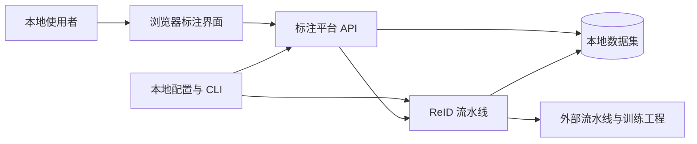

# 总体设计书 Annotation Toolkits 概述

## 0. 关于本书群

本书群描述当前系统架构与跨系统约束，需求定义见[需求分析书](../requirements/00_概述.md)，模块契约见[详细设计书](../detailed_design/00_概述.md)。架构解释来自现有代码、配置和文档；演进建议明确标注，不表示已经实现或排入开发计划。术语复用[统一术语表](../detailed_design/05_术语表.md)。

| 文档 | 范围 |
|---|---|
| [系统架构](10_系统架构.md) | 上下文、分层、技术选择及代价 |
| [标注平台与前端](20_标注平台与前端.md) | 项目分发、交互、任务模块与扩展边界 |
| [ReID子系统](30_ReID子系统.md) | 数据闭环与异步执行 |
| [数据与接口](70_数据与接口.md) | 数据所有权、关键链路与一致性 |
| [质量属性](80_质量属性.md) | 质量约束的设计措施与验证 |
| [部署与演进](90_部署与演进.md) | 拓扑、故障域、备份及兼容演进 |

## 1. 参照与追溯

| 需求 | 总体设计 | 详细设计 |
|---|---|---|
| [FR-001～FR-007](../requirements/20_项目与图像标注.md) | [标注平台与前端](20_标注平台与前端.md) | [后端](../detailed_design/20_标注平台后端.md)、[前端](../detailed_design/40_React前端.md) |
| [FR-008～FR-011](../requirements/30_ReID数据闭环.md) | [ReID子系统](30_ReID子系统.md) | [流水线](../detailed_design/30_ReID流水线.md) |
| [FR-012～FR-013](../requirements/70_数据与外部交互.md) | [数据与接口](70_数据与接口.md) | [外部接口](../detailed_design/70_外部接口.md) |
| [NFR-001～NFR-005](../requirements/80_非功能需求.md) | [质量属性](80_质量属性.md)、[部署与演进](90_部署与演进.md) | [通用设计](../detailed_design/10_通用设计.md)、[运维](../detailed_design/90_部署与运维.md) |

## 2. 目标与边界

系统服务本地可信环境中的数据准备、图像标注和 ReID 数据处理。浏览器负责交互，后端负责项目解析、结果校验与本地存储，外部流水线和训练工程负责模型推理、跟踪及训练算法。当前架构不提供账户认证、数据库、对象存储或分布式调度。

部署按单个后端进程设计：文件锁和 ReID 执行门均为进程内锁。这一约束来自当前实现，不意味着单进程已经满足任意规模的性能要求。

## 3. 系统全貌

三个主要职责域分别是浏览器交互、通用标注平台、ReID 数据闭环。它们不是三个独立后端服务；ReID 适配器和后台线程运行在同一个 API 进程，CLI 则可作为独立进程执行。

## 16. 向下一工程的移交

### 16.1 详细设计与验证

接口字段与配置只在对应详细设计展开。集成验证应覆盖配置到任务路由、六类提交到本地存储、ReID 动作到历史记录，以及导出到文件引用的完整链路，逐项对应[验收标准](../requirements/90_验收标准.md)。

### 16.2 未解决设计问题

| 问题 | 影响与所需依据 |
|---|---|
| 最大图像及数据集规模 | 需实测后决定是否限制请求体、增加索引或改变整图提交方式 |
| 多文件失败恢复 | 栅格和索引不具事务保证；若要求崩溃自动恢复，需要确定提交日志或恢复协议 |
| 多人或多进程部署 | 需先明确业务范围，再设计认证授权、跨进程互斥和任务调度 |
| 完整分割导出、Web 导出和修订流程 | 先确认下游契约及业务规则，不能仅凭现有函数推断已支持 |
