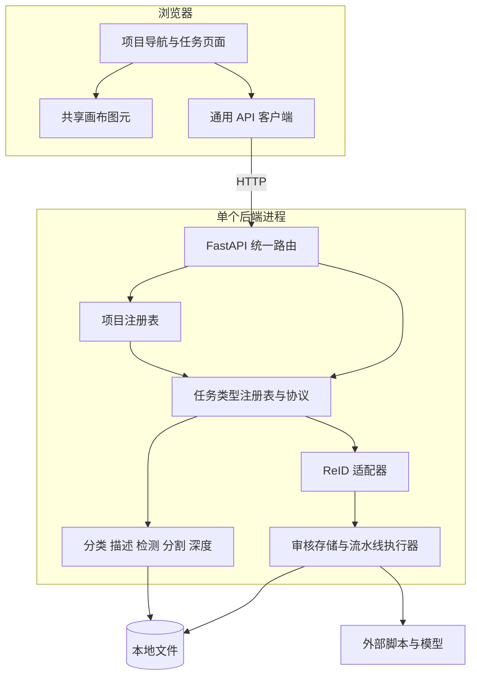

# 系统架构

## 1. 逻辑分层与依赖方向

[server.py](../../backend/annotation_platform/server.py) `create_app` 组织 HTTP 入口；[project_registry.py](../../backend/reid_annotation_tool/project_registry.py) `ProjectRegistry` 解析项目；[task_types.py](../../backend/annotation_platform/task_types.py) `TaskTypeRegistry` 与 `TaskTypeModule` 定义任务分发边界。项目注册表物理上仍位于 ReID 包中，但承担通用平台职责。

平台传递任务自定义结果，不解释标签、框或掩膜。任务模块拥有配置与结果语义，浏览器各任务页拥有编辑交互。ReID 适配器复用已有领域逻辑，普通视觉任务不经 ReID 模型流水线处理。

## 2. 当前选择及代价

以下是当前实现的设计解释，不表示存在未记录的历史方案评审。

| 设计议题 | 当前方案与依据 | 收益与代价 | 重新评估条件 |
|---|---|---|---|
| 存储 | 各任务 Store 直接管理本地 JSON、CSV、PNG | 安装与交付简单；队列扫描、整份状态读取及多文件一致性受本地文件方式限制 | 大数据集、并发写或事务要求出现 |
| 扩展 | `TaskTypeModule` 必需能力与可选 `TaskActionModule` | HTTP 层稳定；新任务仍需后端注册和前端显式页面接入 | 外部插件动态加载成为需求 |
| 前端 | React 页面与共享画布，API 类型从 OpenAPI 生成 | 坐标、指针与像素图元复用；任务自定义结果仍需领域校验 | 交互复杂度或浏览器容量超出现有方式 |
| 图像处理 | 浏览器测量尺寸并编辑像素；后端只编码提交的灰度栅格 | 基础运行依赖轻；服务端不独立核验源图真实尺寸，整图传输耗费内存和带宽 | 大图性能或强数据校验要求出现 |
| ReID 执行 | 进程内线程及全局执行门，复用 CLI 阶段 | HTTP 请求不等待整段流水线；重启中断且不提供分布式执行 | 需要并发阶段或可靠任务续跑 |
| 信任模型 | 本地单用户、来源限制和路径约束 | 无账户管理依赖；CORS 不承担身份认证 | 开放网络或多人隔离成为需求 |

## 3. 架构约束的归属

子系统职责见[标注平台与前端](20_标注平台与前端.md)和[ReID子系统](30_ReID子系统.md)，提交的一致性与重试边界见[数据与接口](70_数据与接口.md)。运行依赖的一次信息源是 [pyproject.toml](../../backend/pyproject.toml) 与 [package.json](../../frontend/package.json)，不在总体设计复制版本或默认值。
