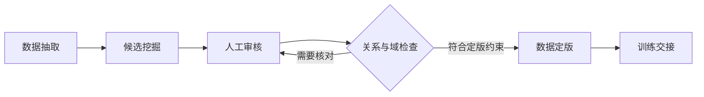

# ReID 子系统总体设计

**上位设计**：[系统架构](10_系统架构.md)。**对应需求**：[FR-008～FR-011](../requirements/30_ReID数据闭环.md)。**详细设计**：[ReID流水线](../detailed_design/30_ReID流水线.md)。

## 1. 职责与外部边界

ReID 负责将流水线输出组织成候选、人工关系、检查报告与可交接的数据。外部脚本承担检测、身份分配、跟踪和训练算法；参考脚本便于接入，但不会使平台成为通用模型服务。模型相似度只能给审核排序，身份关系以领域规则和人工证据为依据。

| 协作对象 | 输入与输出 | 契约归属 |
|---|---|---|
| 用户流水线 | 输入视频/配置，输出符合抽取约定的记录与裁剪来源 | [contract.py](../../backend/reid_annotation_tool/contract.py) |
| 通用标注平台 | 队列、判定、状态、导出与可选动作 | [reid_task.py](../../backend/annotation_platform/reid_task.py) `ReIDTaskType` |
| CLI | 直接调用同一组领域阶段 | [app.py](../../backend/reid_annotation_tool/app.py) `DISPATCH` |
| 外部训练工程 | 数据引用和训练配置，返回进程结果及产物 | [handoff.py](../../backend/reid_annotation_tool/handoff.py) `train`、`evaluate` |

## 2. 数据闭环

普通平台提交采用不覆盖策略；ReID 领域的修订与关系维护工具拥有另外的证据优先级和修订限制，不能将这些能力推导成通用图像标注的编辑接口。规则与入口参照 [revision.py](../../backend/reid_annotation_tool/revision.py) 及操作手册。

## 3. 执行模型与失败传播

平台适配器把已暴露动作委托给 [jobs.py](../../backend/reid_annotation_tool/jobs.py) `JobRunner`，任务复用 CLI 的阶段分发表。同一进程内的执行门在启动时非阻塞获取；忙碌时立即拒绝新动作，不等待自动调度。这保护进程级日志捕获并避免重叠的重量级工作。

任务记录落本地文件，API 返回记录后由浏览器轮询。阶段失败记录错误；进程退出后线程不再执行，下一次加载历史将未完成记录标为失败。日志记录不构成外部脚本回滚或断点续跑机制。CLI/执行器支持的阶段可能多于 Web 暴露的动作；平台能力以 `ReIDTaskType.action_names` 为准。

## 4. 详细设计移交

领域模块维护证据、身份域、冲突和定版语义；通用 API 不复制这些规则。验证应覆盖平台和 CLI 的结果一致性、跨项目执行互斥、失败记录以及重启中断。独立 CLI 与 API 同时写相同数据集不受同一个进程锁保护，部署约束见[部署与演进](90_部署与演进.md)。
