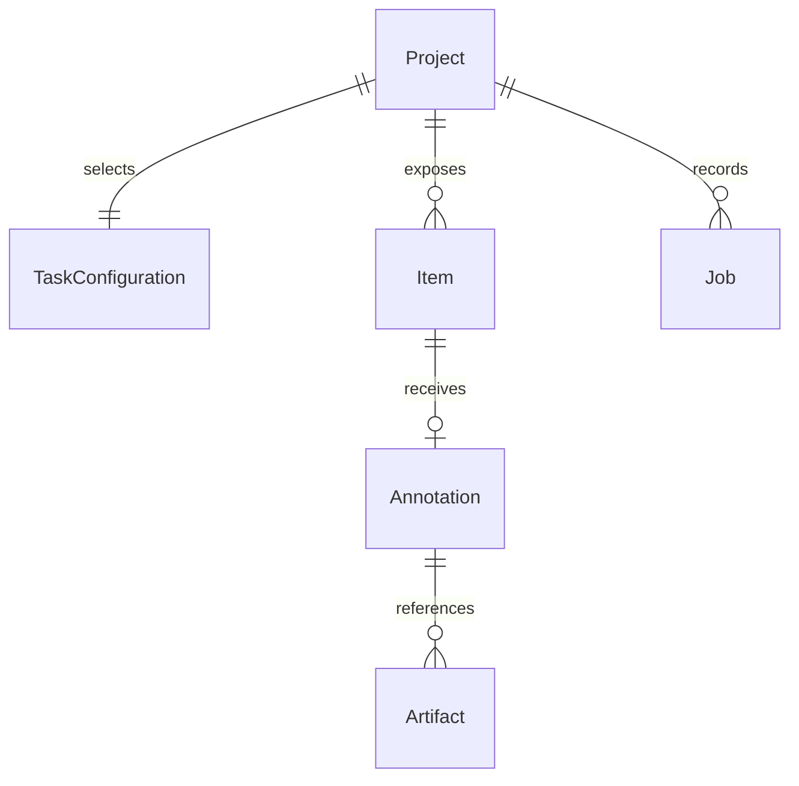
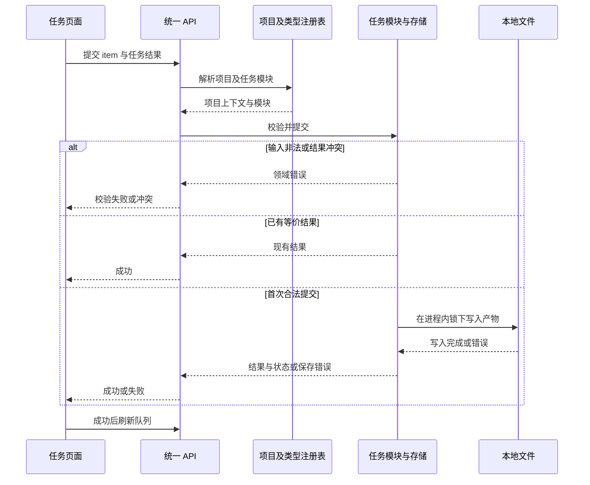

# 数据与接口总体设计

## 1. 数据归属与生命周期

这是概念关系，不是数据库表设计；ReID 的 item 为候选对，普通图像任务为图片。项目登记与任务配置由操作者维护，任务 Store 拥有标注数据，ReID 执行器拥有动作历史。物理结构及字段见[通用详细设计](../detailed_design/10_通用设计.md)与[外部接口](../detailed_design/70_外部接口.md)。

数据从源文件发现进入队列，成功提交后形成标注与历史，导出生成或引用交付产物。源图路径、类别配置和栅格索引共同决定数据含义；备份或迁移必须保持关联。平台不提供统一保留期限或自动删除策略。

## 2. 标注提交链路

任务模块执行规范化、合法性及幂等比较。响应丢失后，重新读取状态或重试同一个等价结果可避免重复标注；这不意味着外部流水线、训练动作可以自动重试。

## 3. 一致性与持久化边界

[local_files.py](../../backend/annotation_platform/local_files.py) `file_lock` 按解析后的路径共享进程内锁；原子写入先写临时文件并刷新，再替换目标文件。这个保证针对单文件替换，不是数据库事务，也不是跨进程锁或断电一致性证明。

[SegmentationStore.submit](../../backend/annotation_platform/segmentation_task.py) 与 [DepthStore.submit](../../backend/annotation_platform/depth_task.py) 先写 PNG，再写索引。若第二步失败，可能留有未被索引引用的 PNG；当前没有跨文件提交日志与自动补偿。读取已完成状态应以索引为依据，恢复时需核对索引及文件，不能只凭 PNG 存在认定提交成功。

## 4. 接口与信任边界

| 交互 | 当前方式 | 认证与失败语义 |
|---|---|---|
| 浏览器到平台 | 同步 HTTP，动作异步执行后轮询 | 无账户认证；CORS 限定浏览器来源；业务校验和冲突由统一错误映射表达 |
| 项目媒体读取 | 受项目根路径约束的文件响应 | 拒绝逃逸或缺失路径；项目内可读文件不按用户细分授权 |
| 导出 | Python `TaskTypeModule.export` | 本地调用；无对应统一 HTTP 导出入口；不支持格式由模块拒绝 |
| ReID 外部处理 | 本地流水线与训练进程 | 操作者配置的可信代码；异常/非零退出记录失败，无自动重试与事务回滚 |

检测的 COCO 兼容导出与分割的掩膜引用导出拥有不同契约；下游是否能够直接使用必须按[接口详细设计](../detailed_design/70_外部接口.md)核对，不能仅凭格式名称判断。前端静态类型也不能替代任务自定义数据的运行时校验。
