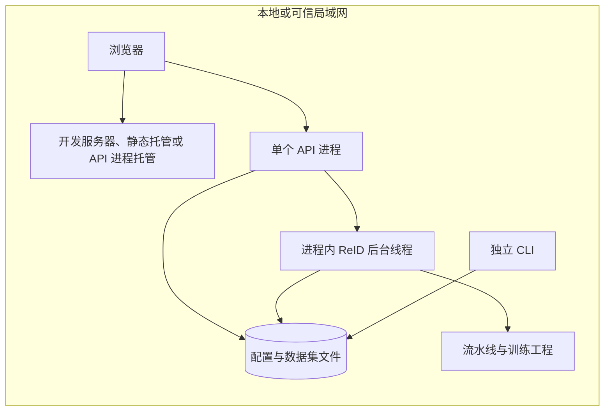

# 部署与演进总体设计

本文原有本地信任、单用户和文件存储约束指 standalone 入口。独立 hosted 入口使用 REST
账号交接与逐用户存储，包含应用自己的 AI 作业库；不开放本地服务器路径或执行器能力。
具体契约见[后端 hosted 设计](../detailed_design/20_标注平台后端.md#独立-hosted-运行入口)及
[迁移与备份](../detailed_design/90_部署与运维.md#6-hosted-迁移备份与恢复)。

## 1. 当前运行拓扑

```mermaid
flowchart LR
    subgraph Trusted[本地或可信局域网]
        Browser[浏览器] --> Static[开发服务器、静态托管或 API 进程托管]
        Browser --> API[单个 API 进程]
        API --> Jobs[进程内 ReID 后台线程]
        API --> Disk[(配置与数据集文件)]
        Jobs --> Disk
        Jobs --> External[流水线与训练工程]
        CLI[独立 CLI] --> Disk
    end
```

开发环境前端与后端各自启动；前端生产产物为静态文件，可由 API 进程同源托管（设置 `ANNOTATION_FRONTEND_DIST`，单端口、无需 CORS），也可由其他托管方提供，此时需支持 SPA 路由回退并配置 API 地址及允许来源。仓库根目录的 Dockerfile 按前一种方式打包为单个可访问 GPU 的容器，工作区挂载为数据目录。Vite 客户端 API 地址在构建时确定，静态产物部署后改变服务器环境变量不会自动修改已打包地址。操作步骤见[部署与运维](../detailed_design/90_部署与运维.md)，配置见[配置参考](../detailed_design/80_配置参考.md)。

依据是 [client.ts](../../frontend/src/api/client.ts) 对 `import.meta.env` 的使用、[server.py](../../backend/annotation_platform/server.py) `create_app`、[Dockerfile](../../Dockerfile)、[jobs.py](../../backend/reid_annotation_tool/jobs.py) `JobRunner` 与 [local_files](../../backend/local_files/__init__.py) `file_lock`。仓库只提供单容器镜像，未提供多实例或反向代理等生产部署编排。

## 2. 故障域与运行约束

| 故障域 | 影响 | 当前处置边界 |
|---|---|---|
| 浏览器或网络 | 请求失败，响应丢失时保存结果可能不确定 | 重读状态，按等价提交规则处理；不假定浏览器草稿已持久化 |
| API 进程 | HTTP 服务与后台线程一起停止 | 重启后重载文件；中断动作标为失败，不续跑 |
| 本地磁盘 | 标注、动作历史及导出可能写入失败 | 核对错误与数据关联；单文件替换不覆盖完整数据集恢复 |
| 外部脚本/模型 | 对应阶段失败或长期占用执行门 | 由操作者处理依赖及产物，平台没有通用取消、超时重试和回滚保证 |

按单后端进程使用；多 worker 或多个实例不能共享进程内互斥。独立 CLI 与 API 也应避免同时写同一数据集。外部脚本使用服务进程的本地权限，不属于沙箱插件执行。

## 3. 备份、恢复与迁移建议

以下是操作建议，未实现自动备份服务：在停止写入及后台动作后，对工作区（项目注册表、任务配置、托管数据）、关联目录中的源数据与标注、栅格和 ReID 关联记录做一致的文件系统快照或备份；浏览器中删除项目不可撤销。恢复到隔离目录后核对队列、标注内容、PNG 引用、类别含义及 ReID 检查结果，再切换到恢复副本。恢复时间与可容忍数据损失待业务确定。

数据目录迁移需同时检查配置路径与产物相对引用。改变标签或类别顺序可能改变历史数据含义；不能把编辑 YAML 当作已完成数据迁移。格式升级应明确版本读取、转换和回退边界，保留原始副本与旧配置；当前没有通用自动迁移框架。

## 4. 演进触发条件

需求要求新增任务时沿用[插件接入边界](20_标注平台与前端.md)；大图或大项目超出现有资源预算时再评估索引与传输方式；要求多用户访问时再设计认证授权及跨进程一致性；要求可靠长任务时再引入独立执行与恢复协议。这些是有条件的设计方向，不是已经批准的技术选型或工作计划。
