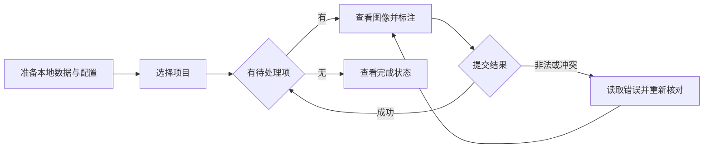

# 角色与场景

## 1. 使用者与边界

系统没有账户角色。下表是同一本地使用者可承担的工作职责，不是权限分组。定位依据见[需求概述](00_概述.md)。

| 工作职责 | 目标 | 可用入口与边界 |
|---|---|---|
| 数据集准备者 | 配置项目、准备源图像或 ReID 输入 | 本地文件与配置；没有 Web 上传或项目创建流程 |
| 标注者 | 逐项完成分类、描述、框、掩膜、深度或候选判定 | 浏览器项目列表、详情及任务页；只读源图像 |
| ReID 流水线操作者 | 抽取、挖掘、检查、定版、交接 | CLI 与平台已暴露动作；外部脚本由本地操作者配置 |
| 数据消费者 | 使用导出数据训练或分析 | 本地导出产物；训练算法与模型效果由外部训练工程负责 |

## 2. 典型标注流程

前置条件是项目已登记、服务已启动且数据集可读。项目不存在、数据集缺失、任务为空与请求失败需要能被区分；失败不表示已完成标注。

分类与描述用表单，检测、分割与深度用画布；图片坐标和显示缩放应保持一致。提交期间页面防止误连点；网络结果不确定时遵循 FR-007 的重复提交规则。

## 3. ReID 使用场景

操作者准备流水线与配置后抽取数据、挖掘候选，标注者判定是否同一身份；检查暴露逻辑冲突后重新核对，满足定版约束后交接训练。流程需求见[ReID数据闭环](30_ReID数据闭环.md)。耗时动作启动后通过状态与日志观察结果；忙碌、失败和重启中断不能被解释为成功。

## 4. 数据交付场景

数据消费者通过任务模块的 Python 导出能力取得产物，核对图片引用、标签定义与栅格文件。当前浏览器没有通用导出按钮，HTTP 也没有统一导出端点。交付边界见[数据与外部交互](70_数据与外部交互.md)。
